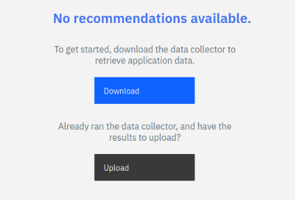
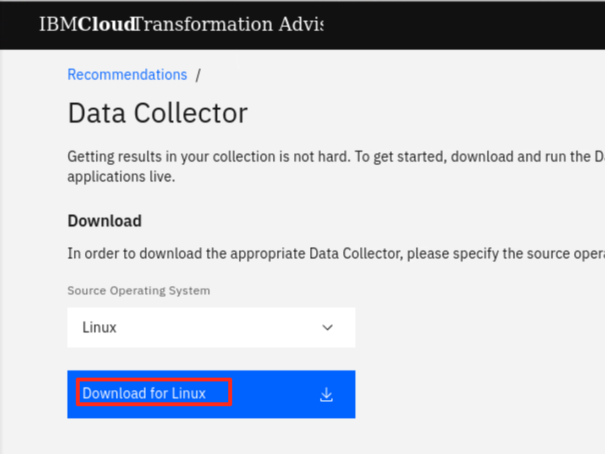
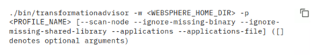
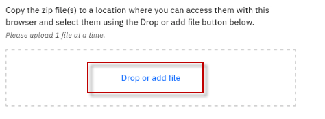
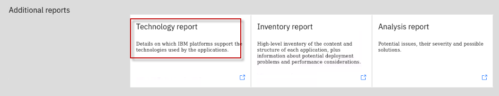
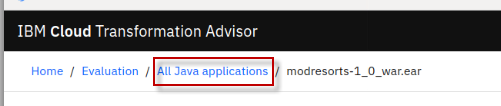

# Modernizacja aplikacji z IBM Transformation Advisor

## Zbieranie danych, ocena aplikacji pod kątem modernizacji oraz wsparcie wdrożenia

 

**Czas trwania:** 45 - 60 minut

## Poznaj IBM Transformation Advisor

To laboratorium zapewnia podstawowe praktyczne doświadczenie w procesie oceny aplikacji działających na tradycyjnym serwerze aplikacyjnym WebSphere na potrzeby ich modernizacji do środowisk kontenerach i Liberty. Pokazuje wartości wynikające z korzystania z Transformation Advisor (TA) w celu oceny lokalnych aplikacji Java i zidentyfikowania odpowienich kandydatów do modernizacji aplikacji.

Dowiesz się również, jak korzystać z akceleratorów wsparcia wdrożenia generowanych przez TA, które pomagają we wdrażaniu i uruchamianiu aplikacji Java na Liberty i w kontenerach.

Po ukończeniu tego laboratorium zdobędziesz doświadczenie w korzystaniu z TA w celu szybkiej analizy lokalnych aplikacji Java bez dostępu do ich kodu źródłowego, szacowania pracy związanej z modernizacją operacyjną i korzystania z akceleratorów wsparcia wdrożenia TA w celu przyspieszenia uruchomienia aplikacji na Liberty i w kontenerach.

**IBM Cloud Transformation Advisor** (Transformation Advisor) to narzędzie wspierające proces modernizacji aplikacji, które jest dostępne w ramach licencji IBM Cloud Pak for Applications i IBM WebSphere Hybrid Edition. Transformation Advisor pomaga szybko ocenić lokalne aplikacje Java EE pod kątem wdrożenia na środowiska kontenerowe i serwery aplikacyjne Liberty.

**Narzędzie Transformation Advisor zapewnia następującą warości:**

  - identyfikacja modelu programowania Java EE w aplikacji.

  - ocena złożoność aplikacji, dzięki inwentaryzacji na wysoki poziomie zawartości i struktury każdej aplikacji.

  - identyfikacja różnic w modelu programowania Java EE i interfejsów API, które mogą mieć wpływ na aplikacje, między środowiskiem startowym, a docelowym.

  - generowanie akceleratorów wsparcia wdrożenia w celu przyspieszenia uruchomienia aplikacji na Liberty i w kontenerach.

Ponadto narzędzie zapewnia rekomendację odpowiedniej edycji IBM WebSphere Application Server i oferuje porady, najlepsze praktyki i potencjalne rozwiązania, aby ocenić złożoność przenoszenia aplikacji do Liberty lub środowisk kontenerowych. Przyspiesza proces migracji aplikacji do chmury, minimalizuje błędy i ryzyko oraz skraca czas wprowadzania na rynek.

## 1. Wprowadzenie

Jak pokazano na poniższym obrazku, Twoja firma ma kilka aplikacji wdrożonych w środowisku WebSphere Application Server (WAS).

Twoja firma chce przenieść te aplikacje na nowoczesny serwer WebSphere Liberty działając na środowisku kontenerowym. Nie jesteś jednak pewien, ile pracy może wymagać proces migracji.

You decide to use the IBM Transformation Advisor to do a quick evaluation of these applications without their source code to identify a good candidate application to move to Liberty and container-based cloud.

After determining a candidate application for modernization to WebSphere Liberty, you use the accelerators generated by TA to deploy and run the application to WebSphere Liberty on your local developer machine and in containers to validate the solution.

Decydujesz się użyć IBM Transformation Advisor, aby przeprowadzić szybką ocenę tych aplikacji bez wglądu w ich kod źródłowy, aby zidentyfikować dobrą aplikację do przeniesienia do Liberty działającą w kontenerach.

Po określeniu aplikacji do modernizacji do WebSphere Liberty, wykorzystasz akceleratorów wygenerowanych przez TA do wdrożenia i uruchomienia aplikacji do WebSphere Liberty na lokalnym komputerze dewelopera i w kontenerach, aby sprawdzić poprawność rozwiązania.

## 2. Cele

Celem tego laboratorium jest::

  - Dowiesz się, jak zbierać dane dotyczące aplikacji Java i konfiguracji przy użyciu narzędzia Transformation Advisor Data Collector.

  - Dowiesz się, jak używać narzędzia Transformation Advisor do oceny pracy wymaganej do modernizacji do  Liberty i środowisk kontenerowych oraz jak identyfikować aplikacje, które nadają się do modernizacji.

  - Dowiesz się, jak wykorzystać akceleratory wygenerowane przez TA do wdrożenia aplikacji w środowisku WebSphere Liberty i kontenerach.

## 3. Wymagania wstępne

Przed rozpoczęciem zajęć laboratoryjnych należy spełnić następujące wymagania wstępne::

  - Znajomość podstawowych poleceń systemu Linux

  - Posiadać dostęp do internetu

  - Posiadać dostęp do środowiska laboratoryjnego

 

## 4. Dostęp do środowiska

Jeśli wykonujesz to laboratorium w ramach warsztatu prowadzonego przez instruktora, środowisko zostało już dla Ciebie przygotowane. Instruktor poda szczegóły dotyczące dostępu do środowiska laboratoryjnego.

 

1.  Uzyskaj dostęp do środowiska laboratoryjnego za pomocą przeglądarki internetowej. 
     
    `Published Service` jest skonfigurowany tak, aby zapewnić dostęp do maszyny wirtualnej **`Stacji roboczej`** poprzez interfejs noVNC dla środowiska laboratoryjnego.
    
    a. Po utworzeniu środowiska demonstracyjnego kliknij przycisk **`environment tile`** aby otworzyć widok szczegółów. 

    b. Kliknij na link **`Published Service`**, który wyświetli **Spis katalogów**  
    
    c. Kliknij na link **`vnc.html`**, aby otworzyć środowisko laboratoryjne poprzez interfejs **noVNC**. 
    
    
    
    d. Kliknij **`Connect`** 
    
      

    e. Wpisz hasło:  **`passw0rd`**. Następnie kliknij **`Send Credentials`**, aby otworzyć środowisko laboratoryjn. 

    > Uwaga: Tam jest numeryczne zero w haśle: passw0rd  

      

	 
	  
	 
2.  Jeśli zostaniesz poproszony o zalogowanie się do maszyny wirtualnej „stacja robocza”, użyj poniższych danych uwierzytelniających: 

    Dane logowania do maszyny wirtualnej „**stacja robocza**” to:
 
     - User ID: **techzone**

     - Password: **IBMDem0s!**

     > Uwaga: Tam jest numeryczne zero w haśle: passw0rd

	  
 
     
	 
	  

 
<b>Kliknij, aby otowrzyć:</b> Wskazówki dotyczące pracy w środowisku laboratoryjnym
 

1. Możesz zmienić rozmiar widocznego obszaru, korzystając z opcji **ustawień noVNC**, aby dopasować rozmiar pulpitu wirtualnego do ekranu.

    a. Z poziomu środowiska VM kliknij **strzałkę** w panelu sterowania noNC, aby otworzyć menu.  

    

    b. Aby zwiększyć widoczny obszar, kliknij `Settings > Scaling Mode` i ustaw wartość na `Remote Resizing` 
      
     

2.  Tekst z ćwiczeń można kopiować i wklejać do środowiska laboratoryjnego, korzystając ze schowka w przeglądarce noVNC. 
   
    a. Skopiuj tekst z ćwieczenia, który chcesz wkleić do środowiska laboratoryjnego.
    
    b. Kliknij ikone **`Clipboard`**, a następnie **`wklej`** tekst do schowka noVNC.

    
    
    c. Wklej tekst do maszyny wirtualnej, np. do okna terminala, okna przeglądarki itp.

    d. Kliknij na ikone **`clipboard`**,aby zamknąć schowek.

   
3. Alternatywą dla opcji Kopiuj/Wklej noVNC jest otwarcie ćwiczeń w przeglądarce internetowej wewnątrz maszyny wirtualnej. Używając tej metody, możesz łatwo skopiować/wkleić tekst z ćwiczenia bez konieczności korzystania ze schowka noVNC. 

 

## 5. Lab Tasks

W tym warsztacie użyjesz narzędzia Transformation Advisor, aby zidentyfikować odpowiednią aplikację do przeniesienia na WebSphere Liberty i kontenery.

Aby określić, które modele programowania Java EE znajdują się na serwerze, zwykle uruchamia się narzędzie Transformation Advisor **Data Collector** na serwerze WebSphere.

W tym laboratorium przeprowadzona zostanie symulacja procesu uruchamiania Data Collector'a, który generuje „kolekcję danych” będącą plikiem zip zawierającym: spis aplikacji, strukturę każdej aplikacji, konfigurację serwera WebSphere wymaganą dla aplikacji oraz różne raporty analityczne.

Dla tego środowiska laboratoryjnego plik archiwum zip z kolekcją danych został już wygenerowany. Zaimportujesz ten plik zip do interfejsu użytkownika Transformation Advisor w celu analizy aplikacji.

Korzystając z Transformation Advisor, uzyskasz wgląd w potencjalne problemy z migracją, które mogą wymagać rozwiązania w przypadku przeniesienia aplikacji do Liberty i kontenerów. Przeglądając raporty z analizy, określisz złożoność wymaganego wysiłku programistycznego i wybierzesz aplikację do migracji do Liberty na kontenerach.

**Oto działania związane z tym procesem::**

  - Symulacja uruchomienia narzędzia Transformation Advisor Data Collector na serwerze WebSphere Application Server w celu uzyskania danych aplikacji

  - Przesłanie pliku archiwum zip kolekcji danych, który został wygenerowany przez kolektor danych do interfejsu użytkownika Transformation Advisor w celu przeprowadzenia analizy.

  - Analiza raportów wygenerowanych przez Transformation Advisor, aby zidentyfikować właściwą aplikację do szybkiej i opłacalnej migracji do Liberty i kontenerów.

## 6. Wykonywanie zadań laboratoryjnych

### 6.1 Oceniane aplikacje WebSphere

Poniższa ilustracja przedstawia aplikacje WebSphere wdrożone w środowisku WebSphere Application Server (WAS). Uruchomiliśmy już narzędzie Transformation Advisor Data Collection na serwerze WebSphere i udostępniliśmy plik archiwum zip z wynikową kolekcją danych na maszynie wirtualnej Workstation, która będzie używana w laboratorium.

___

Będziesz symulować proces zbierania danych. Nie należy jednak uruchamiać kolektora danych, ponieważ to środowisko laboratoryjne nie ma dostępu do środowiska WebSphere.
___

Jak pokazano poniżej, Transformation Advisor zbierze dane aplikacji dla następujących pięciu aplikacji. Podczas analizy tych aplikacji uzyskasz ważne informacje dotyczące tych aplikacji, używanych przez nie technologii JEE, względnej złożoności każdej aplikacji oraz szczegółowej analizy wymaganej pracy i złożoności przenoszenia każdej aplikacji do środowisk chmurowych opartych na Liberty i kontenerach.

___

Na powyższej liście Enterprise Applications można zobaczyć aplikacje, które zostały wdrożone w środowisku WebSphere Application Server. Następnie należy użyć narzędzia Transformation Advisor do przeanalizowania tych aplikacji w celu zidentyfikowania dobrego kandydata do przeniesienia do Liberty.
___

### 6.2 Ucuchomienie Transformation Advisor (lokalnie)

Transformation Advisor może oceniać dowolne aplikacje oparte na Javie. W tym laboratorium użyjesz go do oceny, czy lokalna aplikacja WebSphere, **Mod Resorts**, nadaje się do przeniesienia do Liberty i jaki może być praca, aby ją tam przenieść.

Transformation Advisor jest zainstalowany lokalnie na maszynie wirtualnej **Workstation**. Uruchom narzędzie Transformation Advisor, wykonując poniższe czynności.

1.  Na pasku narzędzi **Stacji roboczej** kliknij ikonę Terminal, aby otworzyć okno Terminala.

    

2.  Sklonuj repozytorium GitHub zawierające artefakty wymagane w tym laboratorium.

        cd /home/techzone

        git clone https://github.com/IBMTechSales/appmod-pot-labfiles

    Po zakończeniu, lokalne repozytorium artefaktów laboratorium jest sklonowane do następującego katalogu na maszynie wirtualnej.. 
    
    > **/home/techzone/appmod-pot-labfiles**

3.  Uruchom **Transformation Advisor** za pomocą poleceń:

        cd /home/techzone/transformation-advisor-local-3.8.1

        ./launchTransformationAdvisor.sh

    Poczekaj na zainicjowanie programu Transformation Advisor i wyświetlenie listy menu akcji.

4.  Wpisz **`5`** i naciśnij **Enter`**, aby uruchomić **Transformation Advisor**.

    

5.  Aplikacja **Transformation Advisor** jest uruchomiona, kliknij prawym przyciskiem myszy łącze URL aplikacji i wybierz **`Open Link`**, aby uruchomić ją w oknie przeglądarki internetowej. 

    Adres URL jest wyświetlany w danych wyjściowych polecenia TA: **http://server0.gym.lan:3000**

    
 
    Strona główna **Transformation Advisor** jest wyświetlana w przeglądarce internetowej.
 
    
 
    W następnej sekcji użyjesz interfejsu użytkownika Transformation Advisor, aby pobrać **narzędzie do zbierania danych** dla środowiska, w którym będzie działał serwer aplikacji WebSphere, takiego jak Windows lub Linux.

### 6.3 Pobierz narzędzie Transformation Advisor Data Collector

Po uruchomieniu Transformation Advisor należy pobrać narzędzie Data Collector, które będzie działać na serwerze WebSphere Application Server.

Aby ocenić lokalne aplikacje Java, należy uruchomić narzędzie **Transformation Advisor Data Collector** dla środowiska serwera aplikacji. Wyodrębni ono informacje o aplikacji ze środowiska. Narzędzie można pobrać z interfejsu użytkownika Transformation Advisor.

1.  Na stronie głównej Transformation Advisor utwórz **new workspace**.
    
    a.  Kliknij **`Create New`** .
    
    
    
    b.  Wprowadź nazwę obszaru roboczego jako **`Evaluation`**, a następnie kliknij przycisk **`Create`**..

    

    |                                          |                                                                                                                                                                                                                                                                            |
    | ---------------------------------------- | -------------------------------------------------------------------------------------------------------------------------------------------------------------------------------------------------------------------------------------------------------------------------- |
    |  | Obszar roboczy to wyznaczony obszar, który będzie zawierał zalecenia dotyczące migracji dostarczone przez **Transformation Advisor** ze środowiska serwera aplikacji. Możesz je nazwać i zorganizować w dowolny sposób, czy to według aplikacji biznesowej, lokalizacji czy zespołów |

    OPo utworzeniu obszaru roboczego dostępne będą opcje **download** narzędzia Data Collector lub **upload** istniejącego pliku danych.
 
    
 
    W tym laboratorium wykonamy następujące kroki:

    - Pobierzesz narzędzie Data Collector dla środowiska Linux.

    - **Zasymulujesz** uruchomienia Data Collector.

    - Prześlesz istniejący plik zip do Transformation Advisor w celu przeprowadzenia analizy.s.

    - Uyjesz akceleratorów wygenerowanych przez Transformation Advisor, aby wdrożyć aplikację Mod Resorts w Liberty i kontenerach.

2.  Kliknij przycisk **`Download`**, aby pobrać Data Collector dla systemu Linux

    

3.  Na stronie pobierania można pobrać narzędzie Data Collector oparte na źródłowym systemie operacyjnym dla środowiska WebSphere. Pokazuje również, jak używać narzędzia wiersza poleceń do zbierania danych aplikacji i konfiguracji z serwerów WebSphere, WebLogic i Tomcat.
    
    a.  Ponieważ laboratoryjna maszyna wirtualna to system operacyjny Linux, kliknij **`Download Linux`**, aby pobrać narzędzie.

    

    Spakowany plik narzędzia Data Collector zostanie zapisany w katalogu **/home/techzone/Downloads** maszyny wirtualnej **Workstation**.

     
 
 
    Przejdź do następnej sekcji laboratorium, aby zasymulować uruchomienie narzędzia do zbierania danych.

### 6.4 Simulate running the Transformation Advisor Data Collector utility

Po pobraniu spakowanego narzędzia Data Collector należy je rozpakować i uruchomić na serwerze WebSphere Application Server (WAS) w celu zebrania wszystkich danych wdrożonych aplikacji i ich konfiguracji z serwera WAS.

Teraz 'zasymulujmy' kroki, aby uruchomić Data Collector.

1.  Wróć do okna `Terminal` i przejdź do katalogu **/home/techzone/Downloads** i wyświetl jego zawartość za pomocą poleceń:

        cd /home/techzone/Downloads/

        ls -l | grep transformationadvisor

    Można zobaczyć pobrany plik narzędzia do zbierania danych o nazwie „**transformationadvisor-Linux\_Evaluation.tgz**”.
 
    

2.  Wyodrębnij narzędzie Data Collector za pomocą następującego polecenia:

        tar xvfz transformationadvisor-Linux_Evaluation.tgz

    Narzędzie do zbierania danych zostanie rozpakowane do katalogu **/home/techzone/Downloads/transformationadvisor-3.8.1**..

    ___

    **Uwaga:** W tym momencie Data Collector jest gotowy do uruchomienia w środowisku WebSphere.
    ___

3.  Wróć do interfejsu użytkownika Transformation Advisor w przeglądarce internetowej, aby wyświetlić sekcję „**Run the Tool**”, która pokazuje polecenie do uruchomienia w środowisku WebSphere.
    
    a.  Na stronie **Data Collector** przewiń w dół do sekcji „**Run Tool**”.

    The data collector command that would be executed is based on the  **domain** and **analysis type** selections you make in this section.
 
    

4.  Wybierz domenę **IBM WebSphere**. Inne domeny obejmują inne środowiska uruchomieniowe JAVA EE.

    **Uwaga:** Polecenie narzędzia do zbierania danych zmienia się na podstawie tego wyboru.
 
    

5.  Wybierz typ analizy „**`Apps and Configuration`**”.

    Wybranie **Apps & Configuration** gwarantuje, że dane aplikacji i dane konfiguracyjne serwera będą zbierane.
 
    Dane konfiguracyjne serwera są niezwykle pomocne w Transformation Advisor do generowania artefaktów wdrożenia w pakiecie migracji, co omówimy w dalszej części laboratorium.
 
    

6.  Przejrzyj, ale **NIE WYKONUJ** polecenia Data Collector pokazanego poniżej, które jest oparte na wybranych opcjach.

    

    ___
    
    **WAŻNE!**
    
    Na potrzeby tego laboratorium uruchomiliśmy już kolektor na serwerze aplikacji WebSphere. Wynikowe archiwum zebranych danych (plik zip) o nazwie AppSrv01.zip jest dostępne do przesłania do interfejsu Transformation Advisor UI. 
    ___

### **6.4.1 WYŁĄCZNIE W CELACH POGLĄDOWYCH: Symulacja uruchomienia narzędzia Transformation Advisor Data Collector**

<table>
<tbody>
<tr class="odd">
<td></td>
<td>
<strong>Ważne:</strong>

Ta sekcja służy wyłącznie do celów poglądowych.

NIE URUCHAMIAJ poleceń przedstawionych w tej sekcji!
</td>
</tr>
</tbody>
</table>

Jeśli WebSphere Application Server i Transformation Advisor mają połączenie, Data Collector można uruchomić w następujący sposób.

1.  Przykład polecenia narzędzia **Data Collector** do rozpoczęcia zbierania informacji o wdrożonych aplikacjach na serwerze WebSphere Application.

    **Ponownie, NIE WYKONUJ następującego polecenia**

        ./bin/transformationadvisor -w <WEBSPHERE_HOME_DIR> -p <PROFILE_NAME>

2.  Wpisz **1**, aby zaakceptować umowę licencyjną i naciśnij **Enter**, jak pokazano poniżej. 

    **Tylko w celach informacyjnych, NIE WYKONUJ poleceń**

    
 
  
    Oto przykład danych wyjściowych z Data Collector, pokazujący postęp analizy profili WebSphere. 
 
    

    ___
    
    **UWAGA: Poniższe informacje mają charakter wyłącznie poglądowy!**
    
    **UWAGA: W tym laboratorium NIE będziesz uruchamiać Data Collector**.
    ___ 

    Proces ten wymaga czasu, w zależności od liczby aplikacji wdrożonych na serwerze WebSphere Application.
 
    Po zakończeniu zbierania aplikacji wyświetlany jest następujący komunikat; 
    
    “**Dziękujemy za przesłanie danych. Możesz przejść do interfejsu użytkownika aplikacji, aby przeprowadzić dalszą analizę.”**
 
    Dane aplikacji są zebrane i zapisane jako plik zip.   
 
    Ogólnie rzecz biorąc, jeśli serwer aplikacji i **Transformation Advisor** znajdują się w tej samej infrastrukturze sieciowej, zebrane dane zostaną automatycznie przesłane do **Transformation Advisor** w celu wyświetlenia wyników analizy.
 
    W przeciwnym razie należy ręcznie przesłać dane do **Transformation Advisor** przed wyświetleniem wyników.

### 6.5 Prześlij zebrane dane do Transformation Advisor

W tej sekcji zostanie przesłany plik zip kolekcji danych „**AppSrv01.zip**” ze środowiska WebSphere do analizy.

Zazwyczaj przed przesłaniem plików zip kolektora danych należy pobrać odpowiedni kolektor danych dla docelowego środowiska operacyjnego, takiego jak Linux, Windows itp.

Ponadto należy uruchomić kolektor danych w środowisku docelowym, aby zebrać dane dla aplikacji. Następnie można zaimportować zebrane dane do Transformation Advisor w celu ich analizy.

___

**Rada:** Jak wspomniano w poprzedniej sekcji, kroki zbierania danych zostały już wykonane, a wynikowy plik **`AppSrv01-3.8.1.zip`** jest dostępny w środowisku laboratoryjnym.
___

1.  Wróć do strony Transformation Advisor w przeglądarce internetowej, kliknij **`Workload type`**, aby przejść do strony rekomendacji.

    

2.  W obszarze roboczym **Evaluation** załaduj plik kolekcji danych **`AppSrv01-3.8.1.zip**.

    a.  Kliknij **`Upload`**, aby załadować plik kolekcji danych.

    

    b.  Na stronie Upload Data kliknij **`Drop or add file`** (Upuść lub dodaj plik).

    

    c.   Przejdź do lokalizacji pliku kolekcji danych **Home > techzone > appmod-pot-labfiles > labs > TransformationAdvisor** i wybierz plik **`AppSrv01-3.8.1.zip`**. Następnie kliknij przycisk **`Open`**.

    

    d.  Plik **AppSrv01-3.8.1.zip** jest teraz gotowy do przesłania. Kliknij przycisk **`Upload`**, aby kontynuować.

    
 
    Po przesłaniu zbioru danych do Transformation Advisor nastąpi przekierowanie z powrotem do ekranu rekomendacji TA.
 
    Zauważ, że strona pokazuje „**Wszystkie aplikacje Java**” z profilu WebSphere Application Server o nazwie **AppSrv01-3.8.1**..
    
 
    

    Poniższe szczegóły znajdują się w sekcji „Podsumowanie obszaru roboczego” na górze strony:

    - **Total Applications**: Łączna liczba aplikacji w obszarze roboczym.

    - **Avg. cost per application**: Średnia liczba dni pracy programistycznej wymagana do migracji aplikacji.

    - **Workspace estimated total costs**
    
      - **Common Code**: Całkowity koszt migracji całego wspólnego kodu w obszarze roboczym na platformę docelową.

      - **Unique app code**: Całkowity koszt migracji całego unikalnego kodu aplikacji (kodu, który nie jest współdzielony między aplikacjami) w obszarze roboczym na platformę docelową..

      - **Total cost**: Całkowity koszt migracji wszystkich aplikacji i wspólnego kodu w obszarze roboczym na platformę docelową.

    W następnej sekcji użyjesz Transformation Advisor, aby wyświetlić analizę danych aplikacji, które zostały zebrane.

### 6.6 Ocena lokalnych aplikacji Java

W tej sekcji użyjesz interfejsu użytkownika Transformation Advisor, aby wyświetlić wyniki analizy danych aplikacji, które zostały zebrane w poprzedniej sekcji.

1.  Na stronie “**All Java applications”** można zobaczyć, że przeanalizowano łącznie 5 aplikacji z serwera WAS.

    
 
     Gdy dane są przesyłane, Transformation Advisor automatycznie wykrywa **maszynę-hosta**, z której pochodzą dane, tzn. gdzie były uruchomione aplikacje serwera aplikacji WebSphere. TA tworzy odpowiednią **kolekcję** i dodaje do niej aplikacje.
 
    Nazwę kolekcji można zmienić podczas uruchamiania narzędzia Data Collector lub edytować w interfejsie użytkownika Transformation Advisor po przesłaniu danych..
 
    W tym przykładzie używana jest domyślna nazwa kolekcji: **admin.ibm.demo**, czyli maszyna hosta, z której pochodzą dane.

2.  Kliknij ikonę **`Collections`** i wyświetl nazwę kolekcji: „**admin.ibm.demo**”.

    
 
    Transformation Advisor analizuje cały **kod aplikacji** i **wspólny kod**, który jest współdzielony między aplikacjami i zapewnia szacunkowy całkowity koszt migracji aplikacji i wspólnego kodu w obszarze roboczym.
 
    Całkowity koszt to liczba dni potrzebnych na migrację tego kodu w celu uruchomienia na wybranym **środowisku docelowym**. W tym przykładzie **WebSphere Liberty** jest wybranym celem migracji.
 
    **Cele migracji obejmują to:**

    - Open Liberty
    - WebSphere Liberty
    - WebSphere Traditional

    
 
    Można wybrać wiele celów migracji, a Transformation Advisor przedstawi całkowity koszt obszaru roboczego dla każdego z wybranych celów.
 
    Zapewnia to wysokopoziomowy widok zakresu prac związanych z migracją wszystkich aplikacji w kolekcji do określonych celów migracji.

    |                                          |                                                                                                                                                                                                                                                                           |
    | ---------------------------------------- | ------------------------------------------------------------------------------------------------------------------------------------------------------------------------------------------------------------------------------------------------------------------------- |
    |  | W zależności od aplikacji, migracja do Open Liberty może wymagać więcej wysiłku niż migracja do WebSphere Liberty. Wynika to z faktu, że Open Liberty nie zawiera wszystkich specyfikacji API Java EE, które są zawarte w WebSphere Liberty. |

3.  W sekcji **Migration Targets** wybierz wszystkie **trzy** cele migracji i zwróć uwagę na różne koszty rozwoju związane z migracją wszystkich 5 aplikacji w obszarze roboczym do różnych docelowych środowisk migracji.

    Tutaj widać, że przeniesienie aplikacji w kolekcji do **WebSphere traditional** wymaga **0 dni** kosztów developmentu, co oznacza, że nie są konieczne żadne zmiany w kodzie.
 
    Jednak przeniesienie do **"WebSphere Liberty ”** może wymagać **2,5 dnia**, a **Open Liberty** może wymagać **5,5 dnia** czasu na development.
 
    
 
    Strona „**Wszystkie aplikacje Java ”** pokazuje również **podsumowanie** wyników analizy **aplikacji** dla wszystkich aplikacji z profilu AppSrv01 dla każdego z wybranych celów migracji.
 
    Dla każdej kombinacji aplikacji / celu migracji można zobaczyć te wyniki:

    - Aplikacja Java (Java application)
    - Nazwa kolekcji / profilu (Collection / Profile name)
    - Złożoność (Complexity)
    - Problemy (Issues)
    - Wymagane zmiany kodu (Required code changes)
    - Koszt zmian aplikacji (w dniach) (Application cost)
    - Plan migracji (Migration plan)

    

    Następujące szczegóły są zawarte w tabeli podsumowującej (jest to widok dla poszczególnych aplikacji):

    - **Application Name**: Nazwa pliku EAR/WAR znalezionego na serwerze aplikacji..

    - **Collection/Profile**: Collection reprezentuje nazwę hosta maszyny, na której znajduje się aplikacja. Profil reprezentuje nazwę profilu na serwerze aplikacji, na którym zainstalowana jest aplikacja.

    - **Complexity**: Wskazuje, jak złożona jest ta aplikacja według Transformation Advisor w przypadku migracji do środowiska kontenerowego.

    - **Issues**: Liczba i waga potencjalnych problemów związanych z migracją aplikacji.

    - **Required code changes**: Wskazuje rodzaj wymaganej zmiany kodu. 
    
    - **Application cost in days**: Zapewnia oszacowanie w dniach nakładu pracy programistycznej w celu przeprowadzenia migracji tylko dla tej aplikacji. Szacunki kosztów obliczone przez Transformation Advisor są jedynie szacunkami na wysokim poziomie i mogą się znacznie różnić w zależności od umiejętności i innych czynników nieuwzględnionych przez narzędzie.

    - **Migration plan**: apliki wspomagające wygenerowane przez Transformation Advisor, aby pomóc w budowaniu i wdrażaniu wybranej aplikacji w docelowym środowisku uruchomieniowym.

### 6.6.1 Ocena aplikacji Customer Order Service

W tej części modułu zapoznasz się ze szczegółami oceny aplikacji Customer Order Service. 

Dowiesz się, w jaki sposób TA zapewnia wgląd w aplikację w odniesieniu do modernizacji do różnych docelowych środowisk uruchomieniowych, takich jak WebSphere traditional, WebSphere Liberty i Open Liberty. 

Dowiesz się, dlaczego różne środowiska docelowe powodują różne koszty developmentu i potencjalne problemy. 

1.	Na stronie „**Wszystkie aplikacje Java**” przefiltruj **CustomerOrderServicesApp.ear** dla wszystkich trzech celów migracji, używając pola wyszukiwania wyszukującego „**Customer**”.

    Filtruje to listę aplikacji tylko do „CustomerOrderServicesApp.ear” w Open Liberty, WebSphere Liberty i WebSphere Traditional.

    

2.	TPierwszą rzeczą, którą należy zauważyć, jest liczba problemów i koszt aplikacji związany z aplikacją dla każdego z trzech środowisk docelowych 

    Na wysokim poziomie widzimy, co następuje: 

    - Przeniesienie aplikacji z WebSphere traditional na maszynach wirtualnych do **WebSphere traditional w kontenerach** ma **SIMPLE** poziom złożoności, nie wymaga zmiany kodu, wymaga zerowych kosztów developmentu i zgłoszono 2 kwestie informacyjne. 

    - Przeniesienie aplikacji do **WebSphere Liberty** ma poziom złożoności **SIMPLE**, nie wymaga zmiany kodu, wymaga zerowych kosztów developmentu i zgłoszono 3 kwestie informacyjne. 

    - Przeniesienie aplikacji do **Open Liberty** ma poziom złożoności **MODERTATE**. Wymagana jest zmiana kodu, a część zmian kodu można zautomatyzować. Wymaga 3,5 dnia kosztów developmentu, aby rozwiązać 1 poważne, 2 niewielkie i 4 zgłoszone kwestie informacyjne.

    

### 6.6.1.2 Analiza CustomerOrderServicesApp.ear w WebSphere Liberty

Następnie zbadajmy, dlaczego koszty developmentu i liczba problemów są wyższe w przypadku przejścia na Open Liberty zamiast WebSphere Liberty. 

Aby to zrobić, musimy zagłębić się w niektóre szczegóły i raporty. 

1.	Przejrzyj szczegóły dotyczące CustomerOrderSrvicesApp.ear dla **WebSphere Liberty**.

    a.	Kliknij na `CustomerOrderSrvicesApp.ear` dla **`WebSphere Liberty`**, aby otworzyć jego widok szczegółowy.

    

    b.	Rozwiń **`Complexity Rules`** dla przeniesienia aplikacji do WebSphere Liberty. 

    Z tego widoku można uzyskać wgląd w powiązane kwestie, które mogą wymagać zmian kodu lub konfiguracji. 

    *W tym przykładzie zgłoszono 3 kwestie informacyjne:*

    - **Bezpieczeństwo Java EE** 
    - **Baza Danych**
    - **Zmiana zachowania podczas wyszukiwania Enterprise JavaBeans w poprzednich wersjach Liberty**

    Te **kwestie informacyjne** są dobrze znane i udokumentowane, jak je rozwiązać za pomocą narzędzi migracyjnych.

    

    Aby zagłębić się w te kwestie, przyjrzyjmy się **Analysis Report** wygenerowanemu przez Transformation Advisor. 

    c.	Przewiń w dół do dolnej części strony szczegółów aplikacji, aby znaleźć dostępne raporty. 

    d.	Kliknij **Analysis Report**, co spowoduje otwarcie raportu w nowej karcie przeglądarki. 

    

    e.	W **Detailed Migration Analysis Report** kliknij łącze **`Informacje`** w kolumnie LABEL. Spowoduje to przejście bezpośrednio do krytycznych kwestii w raporcie. 

    

    f.	Kliknij łącze **`Show rule help`**, aby rozwinąć sekcję pomocy dla zagadnienia **Bezpieczeństwo Java EE**.

    

    g.	Przeczytaj „**rule help**”. Wyjaśnia ona, że podczas przenoszenia aplikacji korzystających z zabezpieczeń Java EE do chmury należy rozważyć, w jaki sposób aplikacja korzysta z rejestru użytkowników, Trust Association Interceptors (TAI) i niestandardowych modułów logowania JAAS, a także lokalnego serwera zabezpieczeń.  

    

    h.	Aby dowiedzieć się, gdzie w kodzie aplikacji te problemy zostały oznaczone, kliknij link **`show results`**. 
    
    

    Zobaczysz moduły, klasy, nazwy metod i numery linii, których dotyczy problem. 
 

    

   
2.	Wróć do karty przeglądarki, która wyświetla „**Stronę szczegółów aplikacji**” i wyświetl **`Technology Report`**.. 

    

    Raport technologiczny zawiera szczegółowe informacje na temat tego, które platformy IBM obsługują technologie Java EE używane przez aplikacje.

    
    ___

    **Rada:** Jeśli pominięte zostaną pola dla określonych wydań Liberty, oznacza to, że kod aplikacji będzie musiał zostać przepisany, aby działał w określonym środowisku docelowym. Zwiększa to koszty aplikacji i dewelopera w projekcie

    **RAda:** WebSphere Liberty zawiera więcej technologii Java EE niż Open Liberty. Jest to częsty powód, dla którego przejście na Open Liberty może być bardziej kosztowne niż na WebSphere Liberty. 
    ___

### 6.6.1.3 Analiza CustomerOrderServicesApp.ear w Open Liberty

W tej sekcji zbadamy szczegóły aplikacji do przejścia na „**Open Liberty**". 

Spójrzmy, dlaczego przeniesienie aplikacji na platformę Open Liberty wymaga więcej wysiłku niż przeniesienie na platformę WebSphere Liberty. 

1.	Wróć do strony „**Wszystkie aplikacje Java**” w TA

    **Uwaga** Liczba potrzebnych dni programowania na przeniesienie aplikacji do Open Liberty wynosi 3,5 dnia, podczas gdy przeniesienie do WebSphere Liberty wynosi 0 dni. Dowiedzmy się dlaczego. 

2.	Kliknij na `CustomerOrderServicesApp.ear` dla **`Open Liberty`**, aby otworzyć jego widok szczegółowy. 

    **Rada:** Możesz wpisać „Customer” w polu wyszukiwania, aby przefiltrować tylko aplikację Customer Order Services.

    

3.	Rozwiń **Complexity rules**, aby zobaczyć szczegóły problemów

    Widzimy, że przejście na Open Liberty flaguje problemy związane z JPA, Persistence unit second-level cache i skanowaniem CDI, które nie zostały oflagowane dla WebSphere Liberty.

    
  
4.	Przewiń w dół do sekcji **"Unique Code Issues ”** w widoku szczegółów. 

    Zobaczysz podział nakładów pracy wymaganych do rozwiązania każdego z oznaczonych problemów. 

    ___
    
    **Uwaga** Konieczność poświęcenia dużej ilości czasu jest związana z tymi kwestiami technologicznymi.  

    Problemy te nie występują w przypadku przejścia na WebSphere Liberty, ponieważ interfejsy API są zawarte w WebSphere Liberty. 
    ___ 

    

6.	Przewiń w dół do dostępnych raportów. Otwórz raport **`Analysis report`**

    

7.	Przejdź do **`Critical rules`**** oznaczonych dla aplikacji przenoszącej się do Open Liberty. 

    

8.	Rozwiń sekcję **`OpenJPA i właściwości konfiguracyjne WebSphere JPA muszą zostać zmigrowane`**.

    Tutaj dowiesz się, że w aplikacji wykryto `JPA 2.0`. 

    W przypadku **Open Liberty** należy ręcznie przeprowadzić migrację z JPA 2.0 do wersji standardowej lub EclipseLink. JPA 2.0 jest starszą specyfikacją Java EE 6.

    **Open Liberty** nie obsługuje tej starej specyfikacji. Jednak **WebSphere Liberty** obsługuje wiele specyfikacji API Java EE 6, w tym JPA 2.0. 

    

W tym badaniu aplikacji Customer Order Services dla **WebSphere Liberty** i **Open Liberty** dowiedziałeś się, dlaczego zakres prac związanych z przejściem na Open Liberty może być WYŻSZY w porównaniu z przejściem na WebSphere Liberty. 

Przede wszystkim WebSphere Liberty zawiera dodatkowe starsze interfejsy API i biblioteki JAVA, których nie zawiera Open Liberty. 

### 6.6.1.4  Analiza pliku konfiguracyjnego serwera Liberty (server.xml) wygenerowanego przez TA

Transformation Advisor nie tylko dostarcza świetnych informacji na temat aplikacji, które rozważasz zmodernizować do WebSphere Liberty lub Open Liberty, ale także generuje akceleratory do budowania i wdrażania aplikacji na Liberty, kontenerach i na Kubernetes. 

W tej sekcji przyjrzymy się **konfiguracji serwera Liberty** `server.xml`, którą TA generuje na podstawie analizy konfiguracji WebSphere, gdy Transformation Advisor Data Collector został uruchomiony na serwerze WebSphere na maszynie wirtualnej.  

Mówiąc prościej, Transformation Advisor tworzy plik server.xml, który zawiera konfigurację serwera Liberty wymaganą do uruchomienia aplikacji na Liberty.  

1.	Wróć do strony **"Wszystkie aplikacje Java ”** w Transformation Advisor, która wyświetla listę podsumowania aplikacji Java 

    

2.	Upewnij się, że wybrany jest tylko cel migracji **`WebSphere Liberty`**.

    

3.	Kliknij na link **`Migration plan`** znajdujący się obok **`CustomerOrderServicesApp.ear`** dla **`WebSphere Liberty`**, który wyświetli plan migracji dla WebSphere Liberty.

    
    
4.	**`Plan migracji** wyświetla „częściową listę” plików wygenerowanych przez Transformation Advisor, aby pomóc w migracji aplikacji.

    - **server.xml:** - Konfiguracja dla serwera Liberty
    - **pom.xml:** - Kompilacja aplikacji przy użyciu Maven
    - **Containerfile:** - Tworzenie obrazu Docker dla aplikacji
    - **application CR:** - Niestandardowy zasób dla aplikacji, która ma zostać wdrożona na OpenShift za pośrednictwem Open Liberty Operator
    - **secret.yaml:** - Plik konfiguracyjny dla ustawień połączenia z bazą danych w OpenShift

    

5.	Kliknij, aby wyświetlić zawartość pliku **`server.xml`**.

    

6.	Plik **server.xml** jest wyświetlany w oknie podglądu pliku, kliknij **`Show more`**, aby go rozwinąć.

    
 

7.	Przejrzyj zawartość pliku **server.xml**.

    Zauważ, że Transformation Advisor wygenerował plik **server.xml**, który zawiera konfigurację serwera Liberty, która została zmapowana z oryginalnego tradycyjnego serwera aplikacji WebSphere. 

    Gdy Transformation Advisors Data Collector został uruchomiony na serwerze aplikacji WebSphere, przeanalizował aplikacje i konfigurację serwera WebSphere. Dane konfiguracyjne serwera zostały wykorzystane do wygenerowania odpowiedniego pliku server.xml w celu skonfigurowania aplikacji na serwerze Liberty. 

    a.	The **Liberty features** that the application uses are configured. 

    

    b.	Konfigurowane są **application endpoints** i **enterprise application module configuration**. Należy zauważyć, że **zmienne ${ }** są używane w celu uproszczenia zastępowania konfiguracji zewnętrznej i przyjmowania wartości domyślnych. 

    

    c.	**Role bezpieczeństwa** używane przez aplikację są skonfigurowane

    

    d.	**Konfiguracja bazy danych** i **aliasy uwierzytelniania** są skonfigurowane. Ponownie należy zwrócić uwagę na użyte zmienne. 

    

    e.	Konfigurowane są **zmienne** i wartości domyślne tam, gdzie ma to sens.

    Zmienne te są używane do wyodrębniania danych, które prawdopodobnie będą się różnić między środowiskami, takimi jak TEST, QA, PROD. 

    Zmienne można łatwo zastąpić zmiennymi środowiskowymi lub configMaps i secrets w środowiskach Kubernetes. 

    

8.	Kliknij, aby pobrać **Plan migracji** wygenerowany przez Transformation Advisor

    

    Pakiet migracji w postaci pliku zip zostanie pobrany do katalogu **Download** maszyny wirtualnej.

###  6.6.2 Analiza aplikacji Mod Resorts

**Mod Resorts jest jedną z aplikacji, których migrację do Liberty chcemy rozważyć.**
 
W tej sekcji przejrzysz wyniki analizy dla aplikacji **modresorts-1_0_war.ear** i określisz, czy jest ona dobrym kandydatem do migracji do Open Liberty lub WebSphere Liberty.

1.	Wróć do strony „All Java Applications” w Transformation Advisor.

    

2.	Wybierz wszystkie trzy cele migracji z menu.

    

3.	W polu **"search ”** wpisz **`modresorts****, co zawęzi listę aplikacji tylko do aplikacji Mod Resorts dla wszystkich trzech celów migracji. 

    

    W tym przykładzie, jeśli chcesz przenieść aplikację **modresorts-1_0_war.ear** do **Open Liberty**, poziom złożoności to **Simple**, co wskazuje, że kod aplikacji nie musi być zmieniany przed przeniesieniem do Open Liberty. 

    Aplikacja nie ma żadnych zależności, nie ma wspólnego kodu ani współdzielonych bibliotek. Ma jeden drobną kwestię (na poziomie informacyjnym). 

    Szacowany nakład pracy na rozwój wynosi zero dni, ponieważ nie jest wymagana zmiana kodu.

    

    Należy zauważyć, że aplikacja modresorts jest również łatwa do migracji do tradycyjnych celów migracji WebSphere Liberty i WebSphere. 

    

    W tym ćwiczeniu skupisz się na modernizacji aplikacji `moderesorts-1.0_war.ear` do wersji `Open Liberty`. 

    Następnie przyjrzymy się szczegółowo wynikom analizy aplikacji **moderesorts-1.0_war**.ear.

4.  Kliknij link **`modresorts-1_0_war.ear`** do **Open Liberty**, aby rozwinąć wyniki analizy..

    
 

    Pierwszą sekcją na stronie podsumowania analizy szczegółowej jest sekcja **Complexity rules section**. Ogólna złożoność aplikacji to **simple**, co oznacza, że aplikacja może być bezpośrednio przeniesiona do Open Liberty bez żadnych zmian w kodzie.
 
    

5.  Przewiń w dół do sekcji **`Complexity Rules**. Możesz zobaczyć, że nie jest wymagana zmiana kodu i nie ma kosztów developmentu, szacowany koszt migracji wynosi **0 dni**..

    Szacunki te opierają się na danych pochodzących z usług IBM, które obejmują migrację kodu aplikacji, ale nie obejmują pełnego zakresu projektu migracji, który obejmowałby konfigurację serwerów, testowanie itp.
 
    

6.  Rozwiń sekcję **`Issues and details`**. Widać, że jedyny niewielki potencjalny problem dotyczy konfiguracji CDI (Context Dependency Injection beans).

    

7.  Następnie przewiń w dół do dolnej części strony i kliknij łącze **`Technology Report`**, co spowoduje otwarcie nowego okna przeglądarki w celu wyświetlenia raport z oceną aplikacji.

    
 
    Raport **Technology report** zawiera listę wszystkich technologii Java wykorzystywanych przez aplikację oraz informację, czy technologie te są obsługiwane przez konkretną platformę WebSphere, od Liberty for Java on IBM Cloud do WebSphere traditional for z/OS.
 
    Służy on do określenia, czy dany produkt WebSphere jest odpowiedni dla danej aplikacji.

    <table>
    <tbody>
    <tr class="odd">
    <td></td>
    <td>
<strong>Rada:</strong>

    
Jeśli złożoność migracji do środowiska docelowego wynosi „<strong>Complex</strong>”, oznacza to, że niektóre interfejsy API nie są dostępne w docelowym środowisku uruchomieniowym i aplikacja będzie musiała zostać przepisana, aby korzystać z innych interfejsów API.
</td>
    </tr>
    </tbody>
    </table>

    
 
    Jak widać z raportu, aplikacja Mod Resorts używa tylko **Java Servlet**, który jest obsługiwany przez wszystkie wersje WebSphere.

8. Wróć do strony Transformation Advisor i kliknij łącze **`Inventory Report`**.

    
 
    Raport **Inventory Report** pomaga sprawdzić, co znajduje się w aplikacji, w tym liczbę modułów, ich relacje i technologie w tych modułach.
 
    Daje również wgląd we wszystkie pliki narzędziowe JAR w aplikacji oraz **nazwy pakietów Java** w plikach jar, co pomoże zidentyfikować, czy klasy są kodem aplikacji klienta, czy kodem strony trzeciej. Uwzględniono również potencjalne problemy związane z wdrażaniem i wydajnością.
 
    

    a.  Przewiń w dół `Inventory Report`, aby wyświetlić ten raport, który służy jako dobre narzędzie do podejmowania decyzji, informujące o tym, co znajduje się w środowisku uruchomieniowym aplikacji i pomagające lepiej zrozumieć środowisko uruchomieniowe aplikacji, jego komponenty i relacje między nimi.

    

9. W raporcie `Inventory report` przejrzyj nazwy pakietów klas w utility Jars
    
    a.  Przewiń w dół, aby wyświetlić sekcję **Contained Archives** i kliknij link „**show details*” obok **modresorts-1.0.war**.
    
    b.  Następnie przewiń w dół do **Użytkowe pliki JAR** i kliknij link „**pokaż szczegóły**” obok **Użytkowych plików JAR**.
    
    c.  Wyświetl **nazwy archiwów** plików jar i **pakiety** użyte w plikach JAR.

    Jest to dobry sposób na określenie, czy kod w utility JARS zawiera kod klienta lub czy są to pliki jars trzeciej strony, takie jak (org.pache\*).
 
    Dodatkowo, jeśli złożoność migracji aplikacji to SIMPLE, warto sprawdzić, czy słoiki narzędziowe zawierają jakiekolwiek pakiety firmowe zaczynające się od org lub inne nazwy pakietów, które są domyślnie IGNOROWANE w Transformation Advisor Data Collector.
 
    Możliwe, że kod aplikacji nie został przeanalizowany z powodu nazw pakietów, które są ignorowane przez Data Collector
 
    
 
    Z raportów analitycznych, które przejrzałeś powyżej, wiesz, że aplikacja Mod Resorts jest obsługiwana przez Open Liberty, a problem zidentyfikowany przez narzędzie nie wpłynie na migrację aplikacji.
 
    Możesz śmiało wybrać aplikację jako dobrego kandydata do migracji do Open Liberty przy minimalnym wysiłku.

### 6.7 Informacje ogólne o aplikacji Mod Resorts

Ze spostrzeżeń uzyskanych z Transformation Advisor dowiedziałeś się, że Mod Resorts jest prostą aplikacją EE i jest dobrym kandydatem do przejścia na Open Liberty i kontenery.

Dla celów ilustracyjnych, w tej krótkiej sekcji wykonano kilka zrzutów ekranu, aby pokazać aplikację Mod Resorts.

Strona główna aplikacji Mod Resorts wygląda następująco:

Użytkownik wybiera cel swojej podróży

Być może użytkownik chce pojechać do **PARIS, FRANCJA. Mod Resorts pokazuje** pogodę w mieście.

Przejdź do następnej sekcji laboratorium, w której pokrótce zapoznasz się z planem migracji Transformation Advisor.

Plan migracji obejmuje pakiet migracji wygenerowanych artefaktów wdrożenia, które przyspieszają wdrożenie aplikacji do Liberty i wdrożenie kontenerowe.

## 7. Zapoznanie się z pakietem migracyjnym dla aplikacji Mod Resorts

Transformation Advisor wyświetla szczegóły dotyczące **migration bundle**, który został wygenerowany w celu przyspieszenia modernizacji aplikacji do Liberty lub tradycyjnego WebSphere w kontenerach i na OpenShift. Pakiet migracyjny zawiera różne artefakty, w zależności od potrzeb aplikacji, aby przyspieszyć kompilację i wdrożenie obrazu Docker aplikacji na platformie OpenShift.

Teraz szybko przeanalizujmy **Migration Plan** dla aplikacji Mod Resorts, aby zobaczyć artefakty tworzone przez Transformation Advisor w celu przyspieszenia wdrożenia aplikacji na platformie OpenShift.

1.  Wróć do strony „**Wszystkie aplikacje Java**” w Transformation Advisor, która wyświetla listę podsumowania aplikacji Java.

    

2.  Upewnij się, że wybrany jest tylko cel migracji **`Open Liberty`**.

    

3.  Kliknij link **`Migration plan`** znajdujący się obok analizy aplikacji Mod Resorts dla `Open Liberty`, który wyświetli **`plan migracji`** dla modresorts dla celu Open Liberty.

    

7.  Kliknij łącze **`Download`**, aby pobrać pakiet artefaktów do lokalnego systemu plików na maszynie wirtualnej stacji roboczej.

    Plik **modresorts10war_migrationBundle.zip** zostanie pobrany do katalogu **/home/techzone/Downloads**.
 
     

8.  Rozpakuj artefakty pakietu migracji do nowego folderu na maszynie wirtualnej Workstation.

    a.  W oknie terminala uruchom następujące polecenia, aby rozpakować pakiet migracji do nowego katalogu o nazwie „**modresorts-bundle**”:

        mkdir /home/techzone/modresorts-bundle
        
        cd /home/techzone/modresorts-bundle
        
        cp ~/Downloads/modresorts10war.ear_migrationBundle.zip ~/modresorts-bundle
        
        unzip ~/modresorts-bundle/modresorts10war.ear_migrationBundle.zip
        
        ls

    

9.  Wyświetl plik **server.xml**. NIE NALEŻY ZMIENIAĆ ZAWARTOŚCI PLIKU.

    Plik server.xml w pakiecie migracyjnym jest plikiem konfiguracyjnym serwera Liberty wygenerowanym przez Transformation Advisor, skonfigurowanym dla aplikacji Modresorts.

        gedit ~/modresorts-bundle/src/main/liberty/config/server.xml

    

    - Lista funkcji Liberty zawiera funkcje wymagane przez aplikację.

    - Dołączona jest funkcja **mpMetrics**, która zapewnia punkt końcowy /metrics, z którego można uzyskać dostęp do wszystkich metryk generowanych przez serwer Open Liberty i wdrożone aplikacje.

    - Zmienne są używane, aby wartości, które mogą się różnić między środowiskami, można było łatwo zastąpić zewnętrznymi konfiguracjami, takimi jak zmienne środowiskowe lub configMaps i Secrets w Kubernetes.

10. **Zamknij** edytor po zakończeniu przeglądania pliku. **NIE ZAPISUJ żadnych zmian** w jego zawartości.

11. Wyświetl plik **Containerfile**. Nie zmieniaj zawartości pliku.

    Plik Containerfile w pakiecie migracyjnym służy do tworzenia obrazu kontenera w celu uruchomienia aplikacji modresorts w środowisku uruchomieniowym Liberty w środowisku kontenerowym, takim jak Docker, Kubernetes lub Red Hat OpenShift. Plik Containerfile został wygenerowany przez Transformation Advisor, skonfigurowany do budowania aplikacji Modresorts.

        gedit ~/modresorts-bundle/Containerfile

    - Plik Containerfile jest dwuetapowy.
    
      - Pierwszy etap to „**build-stage**”, który tworzy obraz kontenera dla aplikacji modresorts.
    
      - Drugi etap wykorzystuje obraz kontenera **Open Liberty kernel** i artefakty kompilacji utworzone z „etapu kompilacji” do zbudowania obrazu kontenera modresorts z aplikacją Modresorts i plikami konfiguracyjnymi do wdrożenia w środowisku kontenerowym.

    
 
    

12. **Zamknij** edytor po zakończeniu przeglądania pliku. **NIE ZAPISUJ** żadnych zmian w jego zawartości.
    
13. Na koniec należy dodać plik wykonywalny aplikacji Modresorts do katalogu docelowego pakietu migracyjnego.

        cp /home/techzone/appmod-pot-labfiles/labs/TransformationAdvisor/modresorts-1.0.war ~/modresorts-bundle/target
    
## 8. Użyj akceleratorów Transformation Advisor, aby uruchomić aplikację Mod Resorts na Open Liberty w kontenerach

W tej sekcji użyjesz pliku `Containerfile` z pakietu Transformation Advisor do zbudowania obrazu kontenera i uruchomienia aplikacji modresorts w lokalnym kontenerze.

Plik `Containerfile` jest dwuetapowym plikiem kontenera:

  - Pierwszy etap to „**build-stage**”, który tworzy obraz docker dla aplikacji modresorts.
  
  - Drugi etap wykorzystuje obraz kontenera **Open Liberty kernel** i artefakty kompilacji utworzone z „etapu kompilacji” do zbudowania obrazu kontenera modresorts z aplikacją modresorts i plikami konfiguracyjnymi do wdrożenia w środowisku kontenerowym.
  
  - **RUN features.sh** pobiera funkcje Open Liberty zdefiniowane w pliku server.xml
  
  - **RUN configure.sh** instaluje funkcje Open Liberty w obrazie Docker.

1.  Zbuduj obraz Docker, który zawiera aplikację modresorts na Open Liberty

    a.  W oknie terminala przejdź do katalogu, w którym znajduje się pakiet migracyjny Transformation Advisor. 

        cd ~/modresorts-bundle
    
    b.  Wykonaj polecenie Docker build, aby utworzyć obraz

    - Nazwa obrazu docker będzie **modresorts:1.0,** określona przez parametr -t (tag).

    - Obraz kontenera jest tworzony na podstawie dyrektyw w pliku **Containerfile** określonym przez parametr -f (tag).
    
    - Obraz kontenera jest budowany przy użyciu artefaktów w bieżącym katalogu pakietu migracyjnego, jak określono w szkoleniu **.** w poleceniu

            docker build --no-cache -t modresorts:1.0 -f Containerfile .

    Po zakończeniu zobaczysz, że obraz kontenera został utworzony i oznaczony jako „**modresorts:1.0**”.

    

    c. Wyświetl obraz kontenera i jego znacznik. Nazwa obrazu to „**modresorts**” i jest on oznaczony jako „**1.0**”.

        docker images | grep modresorts

    

2.  Uruchom aplikację Modresorts w kontenerze

        docker run -d -p 9081:9080 --name modresorts modresorts:1.0

    - **-d** uruchamia polecenie docker w trybie odłączonym

    - **-p** mapuje wewnętrzny port 9080 na zewnętrzny port 9081

    - **--name** określa nazwę kontenera docker, który zostanie uruchomiony.

    - **Modresorts:1.0** to nazwa **obrazu docker**, który zostanie użyty do uruchomienia nowego kontenera
           
3.  Sprawdź, czy kontener jest uruchomiony

        docker ps | grep modresorts

    Polecenie „**docker ps**” wyświetla listę kontenerów, które są „uruchomione”.
 
    Uruchomienie „**docker ps -a**” wyświetla listę wszystkich kontenerów, w tym kontenerów, które są zatrzymane.
 
    

4.  Wyświetl dziennik Open Liberty w kontenerze „**modresorts**”, aby sprawdzić, czy aplikacja modresorts została zainstalowana i jest uruchomiona.

        docker logs modresorts

    

5.  Uruchom aplikację modresorts z poziomu przeglądarki internetowej.

    - Aplikacja jest dostępna na porcie: **9081**

    - Katalog główny kontekstu aplikacji to: **/resorts**

        http://localhost:9081/resorts

    

    a.  Możesz kliknąć menu rozwijane „**GDZIE**?” i wybrać miejsce docelowe

    <table> 
    <tbody>
    <tr class="odd">
    <td></td>
    <td>
<strong>Rada!</strong>

    
Jeśli aplikacja nie odpowiada po kliknięciu menu „WHERE TO?”, zwiększ rozmiar okna przeglądarki..

    
Wygląda na to, że jest to usterka aplikacji
</td>
    </tr>
    </tbody>
    </table>

    

6.  **`Zatrzymaj`** i **`Usuń`** kontener. Następnie sprawdź, czy kontener został usunięty, używając polecenia „**docker ps -a ”**.

        docker stop modresorts
        
        docker rm modresorts
        
        docker ps -a | grep modresorts

7.  **`Usuń`** obraz kontenera modresorts. Następnie użyj polecenia „**docker images**”, aby sprawdzić, czy obraz został usunięty

        docker rmi modresorts:1.0

        docker images | grep modresorts

## Podsumowanie

W tym laboratorium dowiedziałeś się, jak ocenić istniejącą aplikację Java za pomocą IBM Cloud Transformation Advisor.

Dowiedziałeś się, jak używać akceleratorów wdrażania wygenerowanych przez Transformation Advisors z pakietu migracji do kompilowania i uruchamiania aplikacji w kontenerach Open Liberty.

Jako część rozwiązań IBM Application Modernization, narzędzie Transformation Advisor zapewnia rekomendację dla odpowiedniej edycji IBM WebSphere Application Server i oferuje porady, najlepsze praktyki i potencjalne rozwiązania w celu oceny łatwości przenoszenia aplikacji do Liberty lub do kontenera WAS, lub do nowszych wersji WebSphere traditional.

Transformation Advisor przyspiesza migrację aplikacji do Liberty i kontenerów oraz pomaga zminimalizować błędy i ryzyko oraz skrócić czas wprowadzania produktów na rynek.

 

**Gratulacje!**

**Ukończyłeś pomyślnie laboratorium "Modernizacja aplikacji z IBM Transformation Advisor Zbieranie danych, ocena aplikacji pod kątem modernizacji oraz wsparcie wdrożenia”**.

W następnym laboratorium dowiesz się jak wdrażyć, bardziej skomplikowaną aplikacje na platformie Red Hat OpenShift Container Platform.
