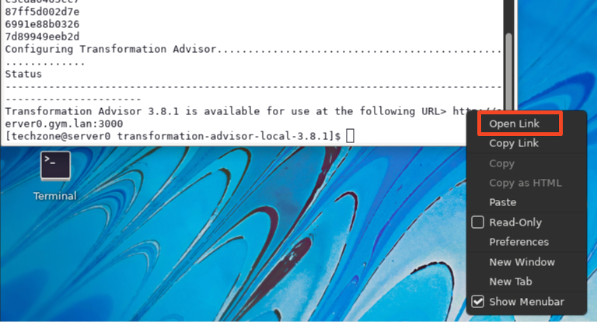
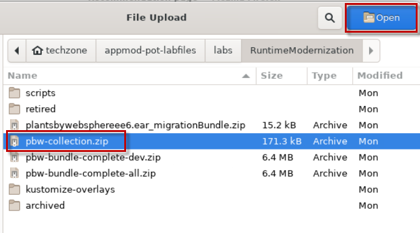
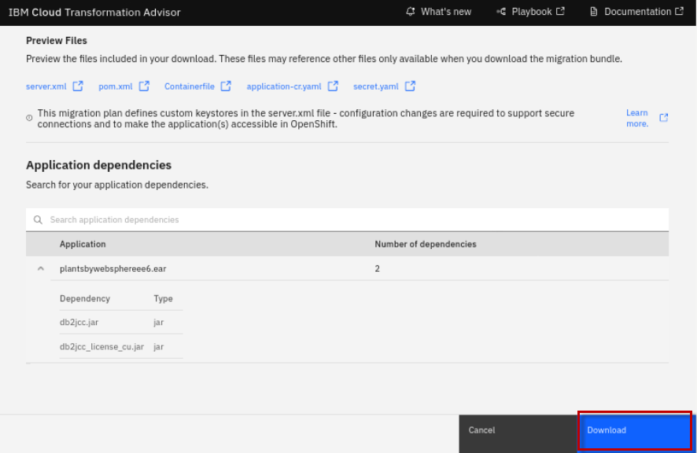
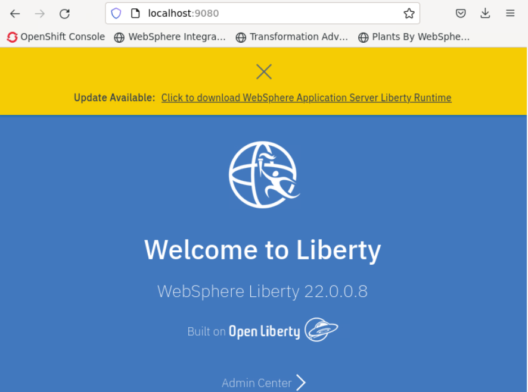
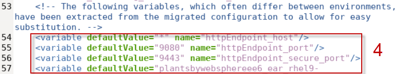
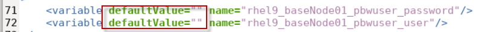
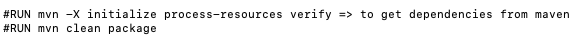
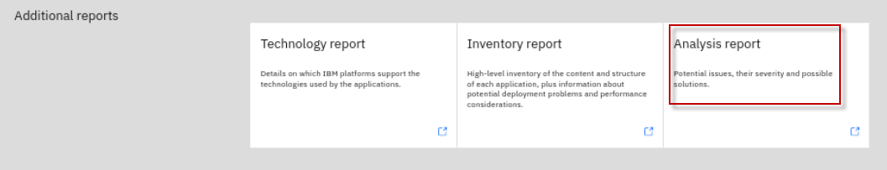

# Wdrożenie i konfiguracja aplikacji Java za pomocą WebSphere Liberty i OpenShift Container Platform


**Czas trwania:** 75 - 90 minut

## Wstęp
To laboratorium pokazuje podstawowy proces modernizacji istniejącej aplikacji Java do WebSphere Liberty, wdrożonej na platformie Kubernetes - Red Hat OpenShift Container Platform. 

Laboratorium koncentruje się na praktycznych aspektach wdrożania i konfiguracji aplikacji, a nie na analizie wyników Transformation Advisor. *Poprzednie laboratorium szczegółowo omówiło Transformation Advisor.*

Po ukończeniu tego modułu zdobędziesz umiejętności używania `pakietu migracyjnego Transformation Advisor` do wdrażania i konfigurowania aplikacji w następujących scenariuszach: 

1.  **do lokalnie uruchomionego WebSphere Liberty** - przydatne do wdrożenia Liberty na maszynie wirtualnej.

2.  **do obrazu kontenera** - przydatne do wdrożania w kontenerach na Kubernetes.

3.  **używając Liberty Operator** - przydatne do wdrożania w OpenShift.

## Cele

Cele tego laboratorium są następujące:

  - Dowiesz się, jak pobrać pakiet migracji aplikacji i użyć go do wdrożenia aplikacji w WebSphere Liberty działającej lokalnie.

  - Dowiesz się, jak w pełni wykorzystać pakiet migracyjny TA i zbudować kontenerowy obraz aplikacji.

  - Poznasz rolę Kustomize podczas wdrażania pakietu migracyjnego.

  - Dowiesz się, jak wdrożyć aplikację w OpenShift za pomocą jednego polecenia.

  - Dowiesz się, jak utworzyć wiele konfiguracji dla aplikacji i wdrożyć je w OpenShift. (opcjonalnie)

## Wymagania wstępne

Przed rozpoczęciem zajęć laboratoryjnych powinieneś:

  - Mieć podstawowe pojęcie o polecenich systemu Linux.

  - Posiadać dostęp do internetu.

  - Posiadać dostęp do środowiska laboratoryjnego.

## Dostęp do środowiska

Jeśli wykonujesz to laboratorium w ramach warsztatu prowadzonego przez instruktora, środowisko zostało już dla Ciebie przygotowane. Instruktor poda szczegóły dotyczące dostępu do środowiska laboratoryjnego.

<br/>

1.  Dostań się do środowiska laboratoryjnego przez przeglądarkę internetową. 
     
    `Środowisko Laboratoryjne` jest skonfigurowany tak, aby zapewnić dostęp do maszyny wirtualnej **`Stacji roboczej`** poprzez interfejs noVNC.
    
    a. Otwórz link otrzymany przez instruktora w przeglądarce internetowej. 

    b. Kliknij na link **`Published Service`**, który wyświetli **Spis katalogów**  
    
    c. Kliknij na link **`vnc.html`**, aby otworzyć środowisko laboratoryjne poprzez interfejs **noVNC**. 
    
    
    
    d. Kliknij **`Connect`** 
    
      


    e. Wpisz hasło:  **`passw0rd`**. Następnie kliknij **`Send Credentials`**, aby otworzyć środowisko laboratoryjn. 

    > Uwaga: Tam jest numeryczne zero w haśle: passw0rd  

      

   
   <br>
   
2.  Jeśli zostaniesz poproszony o zalogowanie się do maszyny wirtualnej `stacja robocza`, użyj poniższych danych uwierzytelniających: 

    Dane logowania do maszyny wirtualnej **`stacja robocza`** to:
 
     - User ID: **techzone**

     - Password: **IBMDem0s!**

     > Uwaga: Tam jest numeryczne zero w haśle: passw0rd

   <br>
 
  
   
   <br>

<details>
 <summary><b><font color="dodgerblue">Kliknij, aby otowrzyć:</font></b> Wskazówki dotyczące pracy w środowisku laboratoryjnym
 </summary>

1. Możesz zmienić rozmiar okna maszyny VM, korzystając z opcji **ustawień noVNC**. Aby dopasować rozmiar pulpitu wirtualnego do ekranu:

    a. Z poziomu środowiska VM kliknij **strzałkę** w panelu sterowania noNC, aby otworzyć menu.  

    

    b. Aby zwiększyć widoczny obszar, kliknij `Settings > Scaling Mode` i ustaw wartość na `Remote Resizing` 
      
     

2.  Tekst z ćwiczeń można kopiować i wklejać do środowiska laboratoryjnego, korzystając ze schowka w przeglądarce noVNC. 
   
    a. Skopiuj tekst z ćwieczenia, który chcesz wkleić do środowiska laboratoryjnego.
    
    b. Kliknij ikone **`Clipboard`**, a następnie **`wklej`** tekst do schowka noVNC.

    
    
    c. Wklej tekst do maszyny wirtualnej, np. do okna terminala, okna przeglądarki itp.

    d. Kliknij na ikone **`clipboard`**,aby zamknąć schowek.

   
3. Alternatywą dla opcji Kopiuj/Wklej noVNC jest otwarcie ćwiczeń w przeglądarce internetowej wewnątrz maszyny wirtualnej. Używając tej metody, możesz łatwo skopiować/wkleić tekst z ćwiczenia bez konieczności korzystania ze schowka noVNC. 

</details>
<br>

## Zadania laboratoryjne

W tym laboratorium użyjesz `migration bundle` (pakiet artefaktów wdrożeniowych) Transformation Advisor do zbudowania obrazu kontenera i wdrożenia aplikacji na lokalnym kontenerze w celu przetestowania zbudowanego obrazu.

Następnie aplikacja zostanie wdrożona w środowiskach `dev` i `staging` w OpenShift. 

Wykorzystasz narzędzia `WebSphere Liberty Operator`, `Kustomize` (natywny framework do zarządzania konfiguracją Kubernetes) oraz artefakty wdrożenia wygenerowane przez pakiet migracyjny IBM Cloud Transformation Advisor.

Aby uprościć laboratorium i umożliwić skupienie się na pakiecie migracyjnym, niektóre oprogramowanie i artefakty zostały już przygotowane. Są to:

  - **Transformation Advisor** został zainstalowany (w poprzednim laboratorium), a dane z serwara do migracji zostały zebrane.

  - **docker** (do tworzenia i uruchamiania obrazów) został zainstalowany.

  - **oc** (narzędzie wiersza poleceń OpenShift do uruchamiania poleceń OCP) zostało zainstalowane.

  - **PlantsByWebSphere Sample Application**, zbudowana jako plik Enterprise Archive (EAR), jest dostępna w dostarczonym repozytorium laboratoryjnym.

  - W celu zaoszczędzenia czasu i umożliwienia skupienia się na wartości i wynikach laboratorium, zostaną użyte **skrypty usprawniające** co przyspieszy wykonywanie zadań (w idealnym przypadku zautomatyzowane czynności byłyby również skryptowane w Twoim środowisku produkcyjnym).


# Cześć 1.: Ocena aplikacji    

## 1.1 Pobierz pliki potrzebne w laboratorium i skonfiguruj środowisko.

1.  Uruchom następujące polecenie w terminalu:

    a.  Otwórz nowe okno Terminala i sklonuj repozytorium git, aby pobrać artefakty laboratoryjne. Jeśli wykonywałeś laboratorium Lab1_TA, przejdź do punktu **`c`**.

    

    b.  Uruchom polecenia, aby sklonować repozytorium git do systemu lokalnego.

        cd /home/techzone

        git clone https://github.com/IBMTechSales/appmod-pot-labfiles.git

    c.  **Dodaj uprawnienia „execute” dla skryptów usprawniających**.

        find /home/techzone/appmod-pot-labfiles -name "*.sh" -exec chmod +x {} \;

2.  Uruchom skrypt, aby skonfigurować środowisko laboratoryjne.

    Skrypt `lab-setup.sh` przenosi pliki ze sklonowanego repozytorium git do katalogu **student** używanego w laboratorium.
 
        cd /home/techzone/appmod-pot-labfiles/labs/RuntimeModernization/scripts
 
        ./lab-setup.sh
 
    Po zakończeniu zobaczysz następujący komunikat wyjściowy.
 
     
    ==========================
 
     lab-setup script completed
 
    ==========================
    

## 1.2 Uruchom Transformation Advisor (lokalnie)

Transformation Advisor zapewnia **`plan migracji`** dla każdej aplikacji ocenianej pod kątem modernizacji. Plan migracji obejmuje **`migration bundle`** wygenerowanych artefaktów, które przyspieszają wdrażanie aplikacji do Liberty w kontenerach i Kubernetes / OpenShift.

Pakiet migracyjny zawiera różne artefakty, w zależności od potrzeb aplikacji i wdrożenia, aby przyspieszyć tworzenie i wdrożanie obrazu kontenera aplikacji na platformie kontenerowej OpenShift.

Transformation Advisor jest uruchamiany lokalnie na maszynie wirtualnej **Stacji roboczej**. 

1. Uruchom narzędzie Transformation Advisor, wykonując poniższe czynności. **Jeśli wykonywałeś laboratorium Lab1_TA, TA jest już uruchomione.** Przejdź do punktu **`d`**.

    a.  Na pasku narzędzi pulpitu maszyny wirtualnej **Stacji roboczej** kliknij ikonę `Terminal`, aby otworzyć okno Terminala.

    

    b.  Uruchom **Transformation Advisor** za pomocą poleceń:

        cd /home/techzone/transformation-advisor-local-3.8.1

        ./launchTransformationAdvisor.sh

     Poczekaj na zainicjowanie programu Transformation Advisor i wyświetlenie listy menu akcji.

    c. Wpisz **`5`** i naciśnij **Enter`**, aby uruchomić **Transformation Advisor**.

     
 
    d. Aplikacja **Transformation Advisor** jest uruchomiona, kliknij prawym przyciskiem myszy łącze URL aplikacji i wybierz **`Open Link`**, aby uruchomić ją w oknie przeglądarki internetowej. 

    Adres URL jest wyświetlany w danych wyjściowych polecenia TA: [**http://server0.gym.lan:3000**](http://server0.gym.lan:3000)
 
     
 
     Strona główna **Transformation Advisor** jest wyświetlana w przeglądarce internetowej.
 
     

    W następnej sekcji utworzysz nowy **`Workspace`** w Transformation Advisor i prześlesz zapisane wyniki skanowania serwera aplikacji WebSphere, który ma wdrożoną pojedynczą aplikację o nazwie `PlantsByWebSphere`.


## 1.3 Tworzenie nowego obszaru roboczego i przesyłanie wyników skanowania z serwera aplikacji WebSphere.

W tej sekcji należy utworzyć nowy obszar roboczy o nazwie **`proof_of_concept`**.

Przestrzeń robocza to wyznaczony obszar, który będzie zawierał zalecenia dotyczące migracji dostarczone przez Transformation Advisor na podstawie wyników skanowania środowiska serwera aplikacji przez Data Collector.

1. Utwórz nowy obszar roboczy o nazwie **proof-of-concept**.

    a.  Na stronie głównej Transformation Advisor kliknij przycisk **`Create New`** (Utwórz nowy).

    b.  Wpisz **`proof_of_concept`** jako nazwę obszaru roboczego. Następnie kliknij przycisk **`Create`** (Utwórz).

     

2. Prześlij **`wyniki skanowania`** dostępne w laboratorium.

    Plik z wynikami skanowania jest dostępny w ramach plików laboratoryjnych.

    Został on utworzony przez uruchomienie narzędzia Transformation Advisor **Data Collector** na serwerze aplikacji WebSphere, na którym wdrożono aplikację **PlantsByWebSphere**.

    a. Kliknij **`Upload`**

    b. Kliknij **`Drop or add file`**.

    

    c.  Przejdź do **Home \> Techzone \> appmod-pot-labfiles \> labs \> RuntimeModernization**

    d.  Wybierz plik **`pbw-collection.zip`**. Następnie kliknij **`Open`**.

    

    e. Po dodaniu pliku **pbw-collection.zip** kliknij **`Upload`**, aby przesłać wyniki do Transformation Advisor.

    

    Po kilku chwilach dane aplikacji zostaną przesłane do interfejsu użytkownika Transformation Advisor.

    Obszar roboczy **proof-of-concept** zawiera dane dla pojedynczej aplikacji, którą wybraliśmy jako przypadek testowy. Przeanalizuj tą aplikację w Transformation Advisor.

    Obszar roboczy **`proof_of_concept`** wyświetla stronę **`All Java Applications`**, która pokazuje zalecenia dla obszaru roboczego.

    Istnieje jedna aplikacja o nazwie **plantsbywebsphereee6.ear**. 
    
    Domyślnie jako cel modernizacji wybrana jest aplikacja `WebSphere Liberty`.

    


## 1.4 Analiza aplikacji plantsbywebsphereee6

 Transformation Advisor dostarcza szczegółowych informacji o każdej aplikacji, która została przeanalizowana. Aplikacja **plantsbywebsphereee6.ear** ma złożoność **`Simple`**.
 
 Złożoność **Simple** oznacza, że:
 
  - Aplikacja jest gotowa do wdrożenia w WebSphere Liberty

  - Nie są wymagane żadne zmiany w kodzie źródłowym
 
   ___
   
   **Uwaga:** Niektóre z innych informacji wyświetlanych w Transformation Advisor opiszemy w dalszej części laboratorium.

   ___


 ***Czemu aplikacja **plantsbywebsphereee6.ear** jest gotowa do wdrożenia, skoro wykazuje 4 problemy?***
 
 W tym przypadku aplikacja ma cztery kwestie (problemy) **`Informacyjne`**.
 
 Kwestie informacyjne nie uniemożliwiają wdrożenia aplikacji w nowym środowisku wykonawczym (WebSphere Liberty), ale mogą wystąpić niewielkie zmiany w zachowaniu aplikacji.
 
 Jeśli podczas testowania zostanie wykryte nieoczekiwane zachowanie, przejrzenie tych **kwestii informacyjnych** może pomóc wyjaśnić, co się dzieje.

1.  Jesteśmy teraz gotowi do przeglądu **`planu migracji`** dla tej aplikacji. 

    a. Kliknij **`Plan migracji`** na końcu wiersza aplikacji **plantsbywebsphereee6.ear**.

    

    b.  Zostanie otwarta strona **Plan migracji**.

    Strona ta zawiera podsumowanie migrowanej aplikacji:

    - podgląd plików, które będą pomocne podczas wdrażania (wyróżnione poniżej).

    - listę zależności aplikacji.

    Wszystkie pliki można pobrać w jednym wygodnym **migration bundle**.

    

2. W dolnej części ekranu znajduje się sekcja **`Appliction Dependencies`** (Zależności aplikacji). 
    
    Pokazuje ona wszystkie pliki, oprócz aplikacji, które są wymagane do wdrożenia. **Plantsbywebspheeee6.ear** ma dwie zależności.

    a. Rozwiń sekcję, aby zobaczyć szczegóły

    b. W tym przypadku do wdrożenia wymagane są biblioteki sterowników DB2 o nazwach **`db2jcc.jar`** i **`db2cc_licence.jar`**.

    

3.  Pobierz pakiet migracyjny, klikając **`Download`** w prawym dolnym rogu. 

    Plik zip o nazwie **`plantsbywebsphereee6.ear_migrationBundle.zip`** zostanie pobrany do folderu **Download**.

    


W następnych cześciach laboratorium krok po kroku przejdziesz przez proces korzystania z pakietu migracyjnego Transformation Advisor w celu wdrożenia **plantsbywebsphereee6.ear**.

  - Upewnisz się, że aplikacja może działać lokalnie na WebSphere Liberty

  - Zbudujesz obraz kontenera działający na WebSphere Liberty

  - Upewnisz się, że aplikacja może działać lokalnie na WebSphere Liberty w kontenerze.

  - Wdrożysz obraz aplikacji na środowisku **`dev`** (i skonfigurujesz ją) za pomocą jednego polecenian na OpenShift.

  - Ponownie wdrożysz i skonfigurować obraz dla środowiska **`staging`** za pomocą jednego polecenia na OpenShift. (opcjonalnie)

# Cześć 2.: Modernizacja środowiska wykonawczego    

## 2.1 Modernizacja środowiska wykonawczego 

**Modernizacja środowiska wykonawczego** polegan na migracji aplikację do środowiska wykonawczego „stworzonego dla chmury”. WebSphere Liberty to szybki, dynamiczny i łatwy w użyciu serwer aplikacji Java.

Liberty jest open source, idealny nadaje się do wdrożenia na środowiska chmurowe i kontenerowe, posiada prostą konfiguracją XML, krótki czasem uruchamiania i nie wymaga restartów serwera w celu załadowania zmian w trybie developerskim.

Aplikacje wdrażane w kontenerowym środowisku wykonawczym WebSphere Liberty mogą być budowane, wdrażane i zarządzane przy użyciu tych samych wspólnych technologii i metodologii, które byłyby używane przez aplikacje natywne dla chmury.

### 2.1.1 Wdrażanie aplikacji PlantsByWebSphere w lokalnie uruchomionym środowisku WebSphere Liberty

W tym środowisku laboratoryjnym WebSphere Liberty jest zainstalowany lokalnie na maszynie wirtualnej **Stacji roboczej**.

W tej cześci ćwiczeń utworzysz nowy serwer Liberty, na którym uruchomisz aplikacje **PlantsByWebSphere**.

Następnie przejrzysz `placeholder files` (pliki zastępcze) w pakiecie Transformation Advisor, aby zobaczyć pliki zależności, które należy skopiować na serwer Liberty.

Następnie użyjesz pliku `server.xml` wygenerowanego przez Transformation Advisor i zawartego w pakiecie migracyjnym, aby skonfigurować serwer Liberty dla aplikacji.

### 2.1.2 Tworzenie lokalnego serwera Liberty

1.  W oknie **`Terminal`** utwórz nowy lokalny serwer WebSphere Liberty o nazwie **`pbwserver`**.

        /home/techzone/wlp/bin/server create pbwserver

    **Odpowiedź:**

    ```
    Server pbwserver created.
    ```

2.  W oknie **Terminal** uruchom lokalny serwer WebSphere Liberty.

        /home/techzone/wlp/bin/server start pbwserver

    **Odpowiedź:**

    ```
    Starting server pbwserver.

    Server pbwserver started with process ID #####
    ```

3.  Upewnij się, że lokalny serwer WebSphere Liberty jest uruchomiony. Otwórz przeglądarkę internetową `Firefox`, otwórz nową kartę przeglądarki. Następnie przejdź do: **http://localhost:9080**

    

4.  Obecnie aplikacja PlantsByWebSphere NIE jest wdrożona na serwerze Liberty. Co więcej, serwer Liberty NIE jest skonfigurowany do uruchamiania aplikacji. 

    a. Z poziomu przeglądarki internetowej spróbuj uzyskać dostęp do aplikacji:

    [**http://localhost:9080/PlantsByWebSphere**](http://localhost:9080/PlantsByWebSphere)
 
    Otrzymasz komunikat, że **`Context Root Not Found`**. Jest to oczekiwane, ponieważ aplikacja nie została jeszcze wdrożona na serwerze Liberty.
    
      


<br/>    

### 2.1.3 Przejrzyj pliki zastępcze w pakiecie migracyjnym

W tej sekcji przejrzysz pakiet migracyjny, aby zobaczyć, jakie pliki należy dodać do konfiguracji WebSphere Liberty, aby uruchomić aplikację. 

Następnie użyjesz dostarczonego pliku konfiguracyjnego Liberty - **`server.xml`**, aby skonfigurować serwer.

Plik `server.xml` służy do konfigurowania Liberty poprzez dostarczanie ustawień dla portów, zabezpieczeń, ścieżek kontekstowych oraz konfiguracji specyficznych dla aplikacji, takich jak dostęp do źródeł danych aplikacji.

1.  Zwróćmy uwagę na 3 `placeholder files` (pliki zastępcze), które są umieszczone w `pakiecie migracyjnym`.

    Pliki zastępcze są wygodnymi odniesieniami, które informują, które pliki należy skopiować na serwer **Liberty**.
 
    *Uwaga: W pełni uzupełnisz pakiet migracyjny w późniejszych krokach.*

    a.  W oknie **Terminal** wyświetl listę plików zastępczych w pakiecie migracyjnym.

        unzip -l /home/techzone/Downloads/plantsbywebsphereee6.ear\_migrationBundle.zip | grep placeholder
 
    
 
    - Katalog **`target`** zawiera plik zastępczy dla pliku EAR aplikacji PlantsByWebSphere. Jest to przypomnienie, że należy skopiować plik EAR aplikacji PlantsByWebSphere na serwer Liberty.

    - Katalog **`src/main/liberty/lib`** zawiera pliki zastępcze dla bibliotek bazy danych DB2 wymaganych przez aplikację. Jest to przypomnienie o konieczności skopiowania bibliotek DB2 na serwer Liberty.

    <br/>

### 2.1.4   Konfiguracja serwera Liberty dla PlantsByWebSphere

W tej sekcji skopiowane zostaną wymagane pliki zależne i konfiguracja serwera do serwera Liberty.

  - Skopiujesz **biblioteki DB2** do katalogu zdefiniowanego w „konfiguracji sterownika DB2” w pliku server.xml.

  - Skopiujesz plik **PlantsByWebSphere EAR** do katalogu `apps` na serwerze Liberty.

  - Skopiujesz plik **server.xml** z pakietu migracyjnego na serwer Liberty, zastępując domyślny plik server.xml.

Aby ułatwić wykonanie powyższych kroków „kopiowania”, przygotowaliśmy **`skrypt usprawniający`**, który tworzy wymagane katalogi i kopiuje pliki na serwer Liberty.

Uruchomienie skryptu, spowoduje wyświetlenie komunikatu o naciśnięciu **`Enter`** przed wykonaniem każdego z poleceń w skrypcie. Pozwoli to na zapoznanie się z poleceniem, unikając konieczności wykonywania czynności kopiowania/wklejania w laboratorium.

<br/>

**Skrypt wykonuje następujące kroki:** 

- **Krok 1**: Tworzy nowy katalog, w którym zostanie rozpakowany pakiet migracyjny.

- **Krok 2**: **Rozpakuje pakiet migracyjny**, zastępując ten, który wcześniej rozpakowałeś w laboratorium.

- **Krok 3:** Stwórzy katalog **`lib/global`** na serwerze Liberty, do którego zostaną skopiowane biblioteki DB2. Katalog ten odpowiada lokalizacji zdefiniowanej w pliku **server.xml**.

- **Krok 4:** Kopiuje biblioteki sterowników DB2 do katalogu `lib/global` na serwerze Liberty.

- **Krok 5:** Kopiuje pliku EAR aplikacji **PlantsByWebSphere** na serwer Liberty. Plik EAR jest kopiowany do katalogu **`apps`** na serwerze.

- **Krok 6:** Kopiuje plik **server.xml** z pakietu migracyjnego na serwer Liberty. Zastąpi on istniejący domyślny plik server.xml, który został utworzony podczas tworzenia serwera.

<br/>

1.  Uruchom skrypt `local-liberty-config.sh`, aby skonfigurować serwer Liberty, jak wspomniano powyżej.

        cd /home/techzone/appmod-pot-labfiles/labs/RuntimeModernization/scripts
 
        ./local-liberty-config.sh -i

    Sprawdź polecenia, które mają zostać wykonane. Następnie naciśnij klawisz `Enter`, gdy będziesz gotowy do wykonania następnego polecenia przez skrypt.
    
    Uwaga: Parametr „`-i`” mówi skryptowi, aby działał w trybie interaktywnym, prosząc o naciśnięcie **`Enter`**, aby uruchomić wyświetlone polecenie.

    <br/>
    
    <details>
     <summary><b><font color="dodgerblue">Kliknij, aby otowrzyć:</font></b> Zrzuty ekranu każdego kroku skryptu „local-liberty-config”
     </summary>

    <br/>

    

    

    

    

    

    

    </details>

    ___

    Po zakończeniu wszystkich kroków skryptu wyświetlany jest następujący komunikat.

    

    ___

2.  Z **Terminala** uruchom serwer Liberty o nazwie **`pbwserver`**.

        /home/techzone/wlp/bin/server start pbwserver

3.  Uruchom ponownie aplikację PlantsByWebSphere z przeglądarki.

        http://localhost:9080/PlantsByWebSphere
 
    Teraz aplikacja działa w Liberty i wyświetlana jest strona główna.
 
    

4.  Spróbuj kliknąć dowolną z zakładek: **`Flowers`**, **`Fruits & Vegetables`**, lub **`Trees`**.

    ___

    **Uwaga na wyjątek.** Jest to oczekiwany błąd. Kwestia dotyczy JPA (dostęp do bazy danych). Użytkownik nie jest zdefiniowany, a zatem uwierzytelnianie w bazie danych nie powiodło się.
 
    
 
    ___

    Strony te powinny wyświetlać katalog elementów w odpowiedniej kategorii, które są pobierane z bazy danych aplikacji. 

    **Co się stało?**
    
    Transformation Advisor nie zbiera żadnych `wrażliwych danych` dla serwera aplikacji. Oznacza to, że informacje konfiguracyjne specyficzne dla aplikacji w pliku **server.xml** nie zostały ustawione. W tym przypadku brakuje `nazwy użytkownika` i `hasła` dostępu do bazy danych.

    W następnej sekcji przejrzysz plik server.xml i dodasz wrażliwe dane wymagane do uzyskania dostępu do bazy danych aplikacji.  

    <br/>

### 2.1.5 Przejrzyj plik server.xml

Teraz należy przejrzeć plik **`server.xml`** i ustawić niezbędne informacje konfiguracyjne. 

Plik **`server.xml`** definiuje zestaw **`funkcji`** wymaganych przez aplikację. Importując tylko niezbędne **funkcje** do obsługi potrzeb API aplikacji, wielkość wdrożonej aplikacji i serwera Liberty jest tak mała, jak to tylko możliwe.

1. Przejrzyj plik server.xml

    Używając edytora **`gedit`** w oknie **`Terminala`**, otwórz plik **server.xml** znajdujący się na serwerze Liberty

        gedit /home/techzone/wlp/usr/servers/pbwserver/server.xml

    - **Sekcja 1** zawiera „funkcje” wymagane przez aplikację, które są wykrywane automatycznie podczas analizy wykonywanej przez **Data Collector** Transformation Advisor.

      

    - **Sekcja 2:** Definiuje `zasoby` wymagane do uzyskania dostępu do bazy danych

      - **`authdata`** określa użytkownika i hasło DB2, które są używane przez źródła danych. Odnoszą się one do zmiennych zdefiniowanych w pliku server.xml.

      - Sterownik **`jdbc`** definiuje wymagane biblioteki. Są to biblioteki skopiowane do tej lokalizacji za pomocą skryptu.

      

    - **Sekcja 3:** **`datasource`** zawiera wszystkie informacje wymagane do uzyskania dostępu do bazy danych: użytkownik bazy danych, hasło, nazwa bazy danych, host i numer portu.

      


    - **Sekcja 4** zawiera zmienne dla **`niewrażliwych danych konfiguracyjnych`**. Na przykład port, na którym ma być uruchomiony serwer. Wartości tych zmiennych są zbierane przez Transformation Advisor.

      

    - **Sekcja 5** zawiera zmienne dla **`wrażliwych danych konfiguracyjnych`**. 
    
      Można zauważyć, że wszystkie wartości tych zmiennych są **puste**, ponieważ informacje te **nie** są gromadzone przez Transformation Advisor.

      


2.  Powodem, dla którego aplikacja **PlantsByWebSphere** zwróciła `Exception` jest to, że wartości **zmiennych wrażliwych** nie zostały ustawione. 
  
    

    Następnie należy zaktualizować plik server.xml, aby zawierał poświadczenia wymagane do uzyskania dostępu do bazy danych aplikacji. 


### 2.1.6 Zaktualizuj server.xml i ponownie przetestuj aplikację PlantsByWebSphere


1. W oknie terminala zatrzymaj serwer Liberty o nazwie `pbwserver`.

        /home/techzone/wlp/bin/server stop pbwserver

2. W otwartym edytorze `gedit` zaktualizuj wartości w pliku **server.xml** dla zmiennych wrażliwych, jak pokazano poniżej:

   a. Przewiń do dołu pliku server.xml, aby wyświetlić zmienne danych wrażliwych. 

   b. Ustaw wartość domyślną dla **rhel9_baseNode01_pbwuser_password** na: **`db2inst1-pwd`**.
    
   c. Ustaw wartość domyślną dla **rhel9_baseNode01_pbwuser_user** na: **`db2inst1`**

     
    
   d. **`Zapisz`** i **`zamknij`** plik server.xml w edytorze.

3. W oknie Terminala uruchom serwer Liberty o nazwie „pbwserver”.

        /home/techzone/wlp/bin/server start pbwserver


4. Przeładuj i przetestuj aplikację PlantsByWebSphere w przeglądarce

        http://localhost:9080/PlantsByWebSphere


    a. Kliknij zakładkę **`Flowers`**. Powinien zostać wyświetlony katalog kwiatów.

    


3. W oknie **Terminal**, `Zatrzymaj` serwer Liberty o nazwie **`pbwserver`**.

        /home/techzone/wlp/bin/server stop pbwserver


### Punkt kontrolny

Na tym etapie laboratorium z powodzeniem zademonstorwałeś proces **modernizacji środowiska wykonawczego** aplikacji PlantsByWebSphere do WebSphere Lberty na lokalnej maszynie wirtualnej. 

W następnych sekcjach przeprowadzisz „Modernizację operacyjną”, wdrażając aplikację PlantsByWebSphere w kontenerach i Red Hat OpenShift. 

# Cześć 3.: Modernizacja operacyjna    

## 3.1 Modernizacja operacyjna

Modernizacja operacyjna daje zespołowi operacyjnemu możliwość przyjęcia nowoczesnych, najlepszych praktyk operacyjnych bez konieczności wprowadzania zmian w pracy zespołu programistów. 

Funkcje skalowania, routingu, klastrowania, wysokiej dostępności i ciągłej dostępności, które wcześniej były dostarczane przez oprogramowanie pośredniczące serwera aplikacji, mogą być dostarczane przez platformę kontenerową. 

Pozwala to zespołowi operacyjnemu na uruchamianie natywnych dla chmury i zmodernizowanych aplikacji w tym samym środowisku z tymi samymi standardowymi ramami rejestrowania, monitorowania i bezpieczeństwa.


### 3.1.1 Analiza pliku `Containerfile` użytego do zbudowania PlantsByWebSphere jako obrazu kontenera

W poprzedniej sekcji użyłeś pliku **server.xml**, aby uruchomić aplikację na lokalnej instancji Liberty. Miało to na celu pokazanie, w jaki sposób używany jest plik **server.xml** wygenerowany przez Transformation Advisor. Jeśli przechodzisz na Liberty w maszynach wirtualnych jako nowe środowisko uruchomieniowe, to już wszystko! 

Jeśli jednak ostatecznym środowiskiem docelowym mają być kontenery, w tej sekcji przeanalizujesz artefakty pakietu migracyjnego Transformation Advisor, które przyspieszają wdrażanie aplikacji do Liberty w kontenerach. 

W przypadku aplikacji o złożoności **`Simple`** nie jest konieczne wykonywanie oddzielnego kroku wdrożania do lokalnej instancji Liberty. Zamiast tego, korzystając z pakietu migracyjnego Transformation Advisor, można wdrożyć aplikację do Liberty działającego w kontenerze za jednym razem. To właśnie zrobimy teraz.

___

W tej części laboratorium pakiet migracji został już zaktualizowany w następujący sposób:

  - Plik **PlantsByWebSphere EAR** został dodany do pakietu migracji. Jego element zastępczy został usunięty.

  - Biblioteki **DB2** zostały dodane do pakietu migracyjnego, a ich elementy zastępcze zostały usunięte.

  - Plik **server.xml** został skonfigurowany z domyślnymi wartościami dostępu do bazy danych.
    
___

 


1.  `Pakiet migracyjny` jest gotowy do użycia w celu wygenerowania obrazu aplikacji działającej na WebSphere Liberty. Aby to zrobić, wykorzystasz **`Containerfile`**, który jest wygenerowany w ramach pakietu migracyjnego.

    

    a. Przejrzyj plik Containerfile w pakiecie migracyjnym

        gedit /home/techzone/Student/labs/appmod/pbw-bundle-complete/Containerfile
 
 
    - Instrukcje **FROM** w pliku **Containerfile** pobierają następujące dwa obrazy. 
     
      - **`Open JDK 8`**
      - **`WebSphere Liberty`** w wersji **23.0.0.12**.

      

      

      ___

      **Uwaga:** Plik Containerfile został zmodyfikowany na potrzeby tego laboratorium, aby pobrać `WebSphere Liberty` w wersji `23.0.0.12`. Domyślnie pobierana jest najnowsza wersja WebSphere Liberty.

      ___

   
    - Polecenia **RUN** w pliku Containerfile tworzą niezbędne struktury folderów i kopiują **pliki binarne** z pakietu migracyjnego do odpowiednich lokalizacji w obrazie.

      

    - W pliku znajduje się kilka linii, które zostały zakomentowane. 
    
      Domyślnie **Containerfile** zakłada, że aplikacja jest dostępna jako plik **binarny**. Jednakże, można go również użyć do zbudowania aplikacji z **kodu źródłowego**. Szczegółowe informacje na temat tego, jak to zrobić, można znaleźć w pliku **README.md** w pakiecie migracyjnym.

      

    b. Zamknij edytor `gedit`. **NIE ZAPISUJ ŻADNYCH ZMIAN W PLIKU!** 

    <br/>


### 3.1.2 Konfiguracja, budowanie i uruchamianie PlantsByWebSphere w lokalnym kontenerze

Aby aplikacja PlantsByWebSphere mogła poprawnie działać w lokalnym kontenerze, wymaga dostępu do bazy danych aplikacji, która działa w oddzielnym kontenerze. 

Kontener aplikacji i kontener bazy danych muszą być podłączone do tej samej lokalnej sieci Docker.

W tym laboratorium należy wykonać następujące kroki, aby zbudować, skonfigurować i uruchomić aplikację PlantsByWebSphere w lokalnym kontenerze:

- **Krok 1:** Upewnij się, że baza danych aplikacji DB2 jest uruchomiona.

- **Krok 2:** Utwórz lokalną sieć Docker.

- **Krok 3:** Upewnij się, że sieć Docker została utworzona.

- **Krok 4:** Podłącz kontener bazy danych DB2 do sieci Docker.

- **Krok 5:** Zbuduj i oznacz obraz kontenera aplikacji.

- **Krok 6:** Uruchom aplikację w kontenerze.

Aby ułatwić wykonanie powyższych kroków, przygotowaliśmy „skrypt usprawniający”, który wykonuje te kroki.

Uruchomienie skryptu, spowoduje wyświetlenie komunikatu o naciśnięciu **`Enter`** przed wykonaniem każdego z poleceń w skrypcie. Pozwoli to na zapoznanie się z poleceniem, unikając konieczności wykonywania czynności kopiowania/wklejania w laboratorium.

1. Uruchom następujące polecenie, aby skonfigurować, zbudować i uruchomić aplikację PlantsByWebSphere w lokalnym kontenerze.

        cd /home/techzone/appmod-pot-labfiles/labs/RuntimeModernization/scripts
 
        ./build-container.sh -i

    **Uwaga:** Parametr `-i` nakazuje skryptowi uruchomienie się w trybie interaktywnym, wyświetlając komunikat o naciśnięciu klawisza **`Enter`** w celu uruchomienia pokazanego polecenia.

    ___

    **Uwaga:** Skrypt wykonuje również wszelkie niezbędne zadania porządkowe, na wypadek konieczności ponownego uruchomienia skryptu z nieznanego powodu.
    ___
    
   
    
    <details>
     <summary><b><font color="dodgerblue">Kliknij, aby otowrzyć:</font></b> Zrzuty ekranu każdego kroku skryptu "build-container".
     </summary>

  
    

    
    

     
    

   
    

    
    

   
    

    
    **Uwaga:** Polecenie `docker run` zawiera kilka parametrów, które zostały wytłumaczone poniżej:
 
    \-d : uruchomienie kontenera w trybie odłączonym.
    
    \-p : udostępnia porty HTTP i HTTPS aplikacji
 
    \--network : podłącz kontener do sieci Docker, do której podłączona jest baza danych DB2
 
    \--rm : usunięcie kontenera po jego zatrzymaniu.
 


    </details>

    ___

    Po zakończeniu wszystkich kroków skryptu wyświetlany jest następujący komunikat. 

    

    ___   

2.  Sprawdź, czy kontener jest uruchomiony.

        docker ps | grep pbw

    

3.  Z poziomu przeglądarki uzyskaj dostęp do aplikacji PlantsByWebSphere uruchomionej w lokalnym kontenerze.

        http://server0.gym.lan:9080/PlantsByWebSphere
 
     
 
    I wyświetlić katalog `Flowers`, który jest pobierany z bazy danych.
 
    

9.  `Zatrzymaj` kontener PlantsByWebSphere

        docker stop pbw

**Uwagi i zalecenia:**

W sekcji laboratorium, którą właśnie ukończyłeś, uruchamiając aplikację w lokalnym kontenerze, zaktualizowaliśmy plik **server.xml**, dodając wartości danych wrażliwych dla dostępu do bazy danych. Następnie umieściliśmy tę konfigurację w obrazie kontenera.

Jednak istotną wartością obrazu kontenera jest to, że jest on **`niezmienny`**. Bez względu na to, gdzie obraz zostanie pobrany i wdrożony, system operacyjny, środowisko uruchomieniowe, poziom poprawek zabezpieczeń itp. będą takie same. Daje to dużą powtarzalność i pozwala uniknąć klasycznego **„ale to działa dla mnie!”**.

Tracimy wiele z tej wartości, jeśli dodamy konfigurację do obrazu, ponieważ będziemy musieli stworzyć nowy obraz dla każdej nowej konfiguracji. Zamiast używać dokładnie tego samego obrazu w każdym środowisku deweloperskim, przejściowym i produkcyjnym, należałoby użyć różnych obrazów. 

___

Dlatego sztywne zakodowanie konfiguracji w obrazie nie jest dobrą praktyką.
___

**Zalecenie:**

W następnej sekcji przyjrzymy się, w jaki sposób pakiet migracyjny pomaga łatwo zarządzać konfiguracją we wszystkich środowiskach i jak upraszcza wdrażanie w klastrze OpenShift. Aby to osiągnąć, pakiet migracyjny wykorzystuje funkcję `Kustomize`.


## 3.2 Dowiedz się, jak Kustomize jest używany w pakiecie migracyjnym

**`kustomize`** to prosty sposób na zarządzanie konfiguracją w różnych wdrożeniach i środowiskach bez potrzeby stosowania szablonów.

Korzystając z **`overlays`**, możesz oddzielić podstawowe informacje konfiguracyjne (porty, nazwy, hosty itp.) od wrażliwych danych (nazwy użytkowników, hasła itp.), które mogą ulec zmianie w każdym wdrożeniu.

Każdy artefakt **kustomize** to zwykły `YAML`, który może być walidowany i przetwarzany w standardowy sposób. Dodatkowo są bardzo czytelne dla użytkownika! Jest on natywnie wbudowany w **kubectl** i klienta **OpenShift**.

1.  W oknie **`Terminala`** wylistuj zawartość folderu **`deploy`** pakietu migracyjnego

        ls /home/techzone/Student/labs/appmod/pbw-bundle-complete/deploy

    

    a.  Istnieją dwa foldery.
    
      - **`k8s:`** Zawiera pliki przyspieszające wdrażanie w **Kubernetes**. Pomagają one tworzyć routes, services i wdrożenia. W tym module skupimy się na wdrażaniu w OpenShift za pomocą **kustomize**.
    
      - **`kustomize:`** Zawiera pliki do wdrożenia przy użyciu **kustomize**.

2.  Przejdź do folderu `Kustomize` znajdującego się w katalogu `deploy`.

        cd /home/techzone/Student/labs/appmod/pbw-bundle-complete/deploy/kustomize

3.  Zbadaj strukturę folderu **kustomize**.
    
        ls -R
        
    
    
        

    **base:**

    - zawiera **`kustomization.yaml`**, który opisuje zasoby zarządzane przez Kustomize

    - zawiera **`application.cr-yaml`**. Jest to **spersonalizowany plik zasobów operatora WebSphere Liberty**, który wykona wdrożenie i zamontuje niezbędne "secrets" i konfigurację, które są tworzone z pliku `secrets` i pliku `config map`. 
    
    **Overlays:**

    - zawiera różne konfiguracje wdrożenia.

    - W tym przypadku tylko jedno wdrożenie zostało utworzone dla systemów **`dev`**.


    **overlays/dev**.

    - Plik `config map yaml` będzie zawierał wszystkie niewrażliwe dane specyficzne dla aplikacji, które zostaną utworzone jako configMaps w OpenShift.

    - Plik `secret yaml` będzie zawierał wszystkie wrażliwe dane specyficzne dla aplikacji, które zostaną utworzone jako secrets w OpenShift.

    - Opcjonalnie folder zawiera dodatkowe pliki yaml, które nadpisują konfigurację w konfiguracji `base`.

    ___

    **Uwaga:** W następnej sekcji użyjemy tej struktury kustomize do wdrożenia obrazu aplikacji.

    Więcej informacji na temat **kustomize** można znaleźć na stronie <http://kustomize.io>.
    
    ___


## 3.3 Wdrożenie na OpenShift

Z poprzednich sekcji laboratorium mamy już zbudowany  `obraz kontenera`. 

W tej sekcji zostanie on przesłany do rejestru obrazów, a następnie wdrożony do projektu OpenShift **`dev`** wraz z konfiguracją za pomocą jednego polecenia, przy użyciu `WebSphere Liberty Operator` i wygenerowanych artefaktów wdrożenia w `migration bundle`.


### 3.3.1 Wdrożenie aplikacji do środowiska OpenShift `dev`.

Aplikacja korzysta z bazy danych DB2, która zawiera katalog elementów używanych w środowisku **`dev`**.

___

**Uwaga:**.  
Po wdrożeniu aplikacji do środowiska **dev** w OpenShift, zbadasz i przeanalizujesz artefakty Liberty Operator i Kustomize yaml w pakiecie migracyjnym, które są używane do wdrożenia aplikacji.

___

Wdrożenie aplikacji **PlantsByWebSphere** i jej konfiguracji w OpenShift można łatwo wykonać za pomocą jednego polecenia.

Jednak w tym laboratorium, zanim będzie można wdrożyć aplikację w OpenShift, obraz kontenera musi zostać odpowiednio oznaczony i przesłany do rejestru obrazów. W tym laboratorium korzystamy z wewnętrznego rejestru OpenShift.

Należy wykonać następujące kroki, które zostaną zrobione przy użyciu skryptu dostarczonego na potrzeby tego laboratorium. 

  - Oznaczenie obrazu kontenera do wypchnięcia do wewnętrznego rejestru OpenShift.

  - Logowanie do OpenShift.

  - Utworzenie projektu `dev`, w którym zostanie wdrożona aplikacja.

  - Logowanie do wewnętrznego rejestru OpenShift.

  - Wysłanie obrazu kontenera do rejestru.

  - Wdrożenie aplikacji i jej konfiguracji w projekcie `dev` OpenShift.

Aby przyspieszyć wykonywanie powyższych kroków, przygotowaliśmy „skrypt usprawniający”, który je wykonuje.

Uruchomienie skryptu, spowoduje wyświetlenie komunikatu o naciśnięciu **`Enter`** przed wykonaniem każdego z poleceń w skrypcie. Pozwoli to na zapoznanie się z poleceniem, unikając konieczności wykonywania czynności kopiowania/wklejania w laboratorium.

1. Uruchom następujące polecenie, aby oznaczyć i wypchnąć obraz kontenera PlantsByWebSphere do wewnętrznego rejestru OpenShift i wdrożyć aplikację w projekcie `dev`.

        cd /home/techzone/appmod-pot-labfiles/labs/RuntimeModernization/scripts
 
        ./dev-deploy-pbw-ocp.sh -i

    **Uwaga:** Parametr `-i` nakazuje skryptowi uruchomienie się w trybie interaktywnym, wyświetlając komunikat o naciśnięciu klawisza **Enter`** w celu uruchomienia pokazanego polecenia.

    ___

    **Uwaga:** Skrypt wykonuje również wszelkie niezbędne zadania porządkowe, na wypadek konieczności ponownego uruchomienia skryptu z nieznanego powodu.

    ___


    <details>
     <summary><b><font color="dodgerblue">Kliknij, aby otowrzyć:</font></b> Zrzuty ekranu każdego kroku skryptu `dev-deploy-pbw-ocp`.
     </summary>

   <br/> 

    **Krok 1:** Oznaczenie obrazu kontenera PlantsByWebSphere w celu wypchnięcia go do wewnętrznego rejestru OpenShift.

    


    **Krok 2:** Logowanie do OpenShift.

    

    **Krok 3:** Utworzenie projektu `dev` w OpenShift, gdzie aplikacja zostanie wdrożona.

    

    **Krok 4:** Przejście do projektu `dev`, gdzie będą wykonywane kolejne polecenia OCP w skrypcie.

    
  
    **Krok 5:** Logowanie do wewnętrznego rejestru OpenShift, abyśmy mogli wypchnąć obraz PlantsByWebSphere.

     

    **Krok 6:** Przesłanie obrazu kontenera PlantsByWebSphere do rejestru obrazów OpenShift.

    

    **Krok 7:** Wyświetlanie rejestru obrazów i sprawdzenie, czy jest dostępny.

    

    **Krok 8:** Wdrożenie aplikacji PlantsByWebSphere i jej konfiguracji w projekcie `dev`.

    

    **Krok 9:** Wylistowanie nowego `wdrożenia` i sprawdzenie, czy jest ono dostępne.

    


    **Krok 10:** Wyświetlenie `poda` PlantsByWebSphere i sprawdzenie, czy jest gotowy.

    

    **Krok 11:** Wyświetlenie `route` do aplikacji PlantsByWebSphere uruchomionej w projekcie `dev`.

    
 
    </details> 

    ___

    Po zakończeniu działania skryptu wyświetlona zostanie **PlantsByWebSphere Route**.

    

    ___

2. W przeglądarce przejdź do route PlantsByWebSphere dla wdrożenia `dev`:

        http://plantsbywebsphereee6-dev.apps.ocp.ibm.edu/PlantsByWebSphere
 

    Opcjonalnie można **`kliknąć prawym przyciskiem myszy`** na adres URL **`PlantsByWebSphere`** w oknie Terminala i wybrać **`otwórz link`**. Spowoduje to uruchomienie aplikacji w przeglądarce internetowej.
 
    

3. Zostanie wyświetlona strona główna PlantsByWebSphere.

    

4. Kliknij kategorię **`Trees`** i wyświetl drzewa załadowane do bazy danych środowiska `dev`.

    Ten katalog drzew został pobrany z bazy danych DB2 w środowisku `dev`.
 
    


###  3.3.2 Przegląd konfiguracji `dev`, która została użyta do wdrożenia aplikacji i konfiguracji

Katalog **`overlays/dev`** zawiera konfigurację, która jest specyficzna i unikalna dla wdrożenia **`dev`**.


1. Sprawdź i dowiedz się, jak skonfigurować wrażliwe dane jako secret Kubernetes
 
    a. W oknie **`Terminal`** przejdź do pliku yaml „`secrets`” w folderze `dev` w pakiecie migracyjnym.

        clear
        
        cd /home/techzone/Student/labs/appmod/pbw-bundle-complete/deploy/kustomize
 
        cat overlays/dev/plantsbywebsphereee6-secret.yaml
 
    
 
    Zauważ, że już wstawiliśmy `user` i `password` bazy danych DB2 do pliku yaml, który konfiguruje wrażliwe dane w secret Kubernetes.
 
    **Uwaga:** Dane w tym pliku MUSZĄ być zakodowane w bese64.


    b. `Jak zakodowaliśmy wartości?`
    
    Aby zaktualizować pakiet migracyjny wrażliwymi danymi, zakodowaliśmy wartości w **Base64**, jak pokazano poniżej.
 
    - Zakodowaliśmy następujące wartości:
   
      ___

      - user: **db2inst1**

        echo db2inst1 | base64

      Zakodowana wartość to: **ZGIyaW5zdDEK**

      ___

      - password: **db2inst1-pwd**

        echo db2inst1-pwd | base64

      Zakodowana wartość to: **ZGIyaW5zdDEtcHdkCg==**

      ___ 

2.  W oknie **Terminal** należy sprawdzić plik **`application-cr.yaml`**.

    Plik **`application-cr.yaml`** jest customowym zasobem WebSphere Liberty używanym do wdrożenia aplikacji PlantsByWebSphere.
 
        
        cd /home/techzone/Student/labs/appmod/pbw-bundle-complete/deploy/kustomize
 
        gedit base/application-cr.yaml

    a.  W tym laboratorium zdecydowaliśmy się nadpisać obraz aplikacji, ponieważ będziemy przesyłać ten sam niezmienny obraz do różnych przestrzeni nazw w OpenShift. 
    
    Dlatego też, zgodnie z zasadami Kustomize, definicja **applicationImage** w pliku application-cr.yaml jest „pusta”. Jest ona nadpisana w overlays/dev.

    

    b.  Referencje `secret` i `configmap` pobierają konfigurację serwera jako `zmienne środowiskowe`.

    

    c.  W tym module nie mamy włączonych zabezpieczeń na poziomie warstwy transportowej.

    

    d.  Musimy zaakceptować licencję.

    

    e.  **`Zamknij`** edytor `gedit`. **NIE ZAPISUJ ŻADNYCH ZMIAN W PLIKU!**
    

3.  W oknie **Terminal**, sprawdź `config map` dla wdrożenia `dev`

     Plik **`plantsbywebsphereee6-configmap.yaml`** zawiera zmienne zdefiniowane w pliku `server.xml`.
 
     Wszystkie wartości zdefiniowane w **configMap** są tworzone jako zmienne środowiskowe w kontenerze. Te zmienne środowiskowe zastępują wszelkie wartości domyślne, które mogły zostać ustawione w server.xml.
 
        cd /home/techzone/Student/labs/appmod/pbw-bundle-complete/deploy/kustomize
 
        gedit overlays/dev/plantsbywebsphereee6-configmap.yaml


    a. Ta konfiguracja zastępuje **nazwę serwera bazy danych**. Odwołuje się do serwera bazy danych aplikacji dla środowiska **`dev`**.

    

    b.  **`Zamknij`** edytor **`gedit`**. **NIE ZAPISUJ ŻADNYCH ZMIAN W PLIKU!**


###  3.3.3 Poznaj WebSphere Liberty Operator w OpenShift

W tej sekcji przyjrzysz się **WebSphere Liberty Operator** w konsoli OpenShift, aby zobaczyć, co zostało wdrożone.

1.  Zaloguj się do konsoli OpenShift

    a.  Otwórz nową kartę w przeglądarce internetowej

    b.  Kliknij zakładkę **`OpenShift Console`** na pasku narzędzi zakładek.

    c.  Dane logowania:

    - Username: `ocadmin`

    - Password: `ibmrhocp`

2.  Zobacz **IBM WebSphere Liberty** `Operator`

    a.  Kliknij na **`Operators > Installed Operators`** w menu po lewej stronie.

    b.  Wpisz **`Liberty`** w filtrze

    c.  Kliknij na **`IBM WebSphere Liberty`**.

    


3. Wyświetl **WebSphereLibertyApplication** `Deployment`.

    a.  Kliknij zakładkę o nazwie **WebSphereLibertyApplication**.

    

    b. Zobaczysz aplikację **plantsbywebsphereee6** wymienioną w namespace `dev`.

    c. Kliknij łącze o nazwie **`plantsbywebsphereee6`** w kolumnie **Name**.

    

    d.  Kliknij zakładkę **`Resources`**.

    

    e. Wybierz łącze dla **`Deployment`**.

    

    f. Wdrożenie PlantsByWebSphere ma uruchomiony jeden `pod`.

    


4.  Wyświetl WebSphereLibertyApplication **`Route`**.

    a.  Wróć do strony **plantsbywebsphereee6 operator**.

    

    b.  Kliknij zakładkę  **`Resources`**.

    

    c.  Kliknij **Kind: `route`**.

    

    d.  Kliknij link **`Location`**.

    

    e.  Strona **Witamy w Liberty** zostanie wyświetlona w nowej karcie przeglądarki. 

    

    f.  Dodaj kontekst główny **`PlantsByWebSphere`**, aby uzyskać dostęp do aplikacji PlantsByWebSphere.

        http://plantsbywebsphereee6-dev.apps.ocp.ibm.edu/PlantsByWebSphere


# Podsumowanie

___
**Gratulacje!**

**Pomyślnie zrealizowano podstawowe cele szkoleniowe w laboratorium!**

___

W tym module dowiedziałeś się, jak wdrożyć aplikacje do WebSphere Liberty przy użyciu WebSphere Liberty Operator i artefaktów wdrożenia utworzonych przez Transformation Advisor w pakiecie migracji.

Zapoznano się z opcjami wdrażania: 

  - Liberty uruchamiane lokalnie.
  - Liberty jako obraz uruchomiony w lokalnym kontenerze.
  - Liberty jako obraz uruchomiony w OpenShift.

Dowiedziałeś się, jak łatwo skonfigurować pakiet migracyjny, aby umożliwić wdrożenie aplikacji dla różnych środowisk.

Dowiedziałeś się o niektórych praktycznych sposobach zabezpieczania danych konfiguracyjnych.

Zapoznałeś się ze szczegółami oceny PlantsByWebSphere i raportami w Transformation Advisor.


___

Możesz kontynuować naukę w opcjonalnych sekcjach laboratorium.

___


# Sekcje opcjonalne: 

<details>
 <summary><b><font color="dodgerblue">Kliknij, aby rozwinąć:</font></b> Sekcja 3.4 (opcjonalna - teoretyczna) GitOps i zarządzanie konfiguracją
 </summary>

<br/>

## 3.4 GitOps i zarządzanie konfiguracją

W tym momencie mamy dwa odrębne elementy do wdrożenia: **obraz aplikacji** i **konfigurację tego obrazu dla każdego potencjalnego środowiska**. W modelu GitOps te dwa elementy są przechowywane w oddzielnych repozytoriach Git. 

Konfigurację można dalej dystrybuować do różnych repozytoriów dla każdego środowiska. Takie podejście pozwala traktować konfigurację tak, jakby była kodem i stosować standardowe techniki tworzenia kodu, takie jak Pull Requests, przegląd kodu i utrzymywać pełną historię audytu. Takie podejście zapewnia doskonałą kontrolę i nadzór nad zmianami konfiguracji klastrów OpenShift, zwłaszcza podczas promowania zmian w środowiskach.


Powyższa ilustracja pochodzi z interesującego artykułu na temat zastosowania GitOps w prawdziwym świecie: <https://developer.ibm.com/blogs/gitops-best-practices-for-the-real-world/>.

W tym laboratorium nie będziemy szczegółowo omawiać wszystkich aspektów GitOps, jednak istnieją dwa istotne obszary, o których warto krótko wspomnieć.

**Dryf konfiguracji**

W przypadku podejścia GitOps istnieje ryzyko, że wdrożona konfiguracja klastra OpenShift nie odpowiada temu, co znajduje się w repozytorium Git. Ktoś mógł na przykład bezpośrednio zaktualizować klaster OpenShift. Istnieje wiele narzędzi do zarządzania tym dryfem. `ArgoCD` jest powszechnym narzędziem do rozwiązywania tego problemu. Można go skonfigurować do synchronizacji ręcznej lub automatycznej, dzięki czemu wszelkie zmiany wprowadzone bezpośrednio w klastrze są przywracane do tego, co znajduje się w repozytorium Git. 

Operator OpenShift GitOps może być użyty do zainstalowania ArgoCD w klastrze OpenShift. Więcej informacji na ten temat można znaleźć tutaj: <https://developer.ibm.com/tutorials/deploy-open-liberty-applications-with-gitops/>

**Zabezpieczanie Secrets**

Nawet w przypadku kontroli i ograniczonego dostępu do repozytoriów Git, przechowywanie wrażliwych danych w postaci zwykłego tekstu (czyli wartości wprowadzonych do plików sekretów) nie jest uważane za dobrą praktykę. Zasadniczo istnieją dwa podejścia, które można zastosować, aby sobie z tym poradzić. Możemy zaszyfrować wartości lub użyć odniesienia:

  - **Szyfrowanie wartości**: W tym podejściu wartość w pliku sekretnym jest szyfrowana, gdy jest zatwierdzana w repozytorium Git. Podczas wdrażania na OpenShift istnieje dodatkowy krok, w którym tajne wartości są odszyfrowywane. `SealedSecrets` jest jedną z implementacji takiego podejścia.

  - **Użyj referencji**: W tym przypadku sekrety i ich wartości są przechowywane w menedżerze sekretów. Podczas wdrażania, referencja jest dostarczana do menedżera sekretów, który następnie montuje sekret do wdrożonego kontenera. Powszechną implementacją tego podejścia jest `HashiCorp Vault`.

W obu przypadkach należy wykonać dodatkową pracę ponad to, co zostało omówione w tym module. Jednak pliki kustomize dostarczone w pakiecie migracyjnym stanowią dobry punkt wyjścia do identyfikacji sekretów i zapewniają standardowe dane wyjściowe, które można przekształcić w celu dostosowania do wybranego podejścia.

</details>


<details>
 <summary><b><font color="dodgerblue">Kliknij, aby rozwinąć:</font></b> Sekcja 4: (opcjonalna - praktyczna) Promocja PlantsByWebSphere do środowiska `staging` w OpenShift
 </summary>

<br/>

## 4.1 Ponowne wdrożenie PlantsByWebSphere do środowiska `staging` w OpenShift

Wdrożyłeś aplikację PlantsByWebSphere z jej konfiguracją do środowiska `dev` za pomocą pojedynczego polecenia kustomize.

W tej sekcji ponownie wdrożysz tę samą aplikację, z inną konfiguracją, do środowiska `staging`, używając pojedynczego polecenia kustomize z inną konfiguracją o nazwie `staging`. 

**Aby to zrobić, musimy wykonać następujące czynności:**

  - Skopiować pliki yaml `dev` do nowego folderu. Nazwiemy go `staging`.

  - Zaktualizować konfigurację specyficzną dla środowiska w nowym folderze `staging`.

___

**Uwaga:**. 

W tej części laboratorium, aplikacja PlantsByWebSphere wdrażana w środowisku `staging`, będzie korzystać z innej bazy danych DB2, niż ta używana w środowisku `dev`.

Typowe jest korzystanie z różnych baz danych, gdy aplikacja jest promowana do wyższych środowisk, które obsługują różne fazy testowania do produkcji.
___


### 4.1.1 Konfiguracja i sprawdzenie konfiguracji wdrożenia „staging

W tym laboratorium baza danych `staging` ma inny zestaw **`Trees`** załadowany do katalogu niż baza danych `dev`.

Podczas gdy w rzeczywistym środowisku różne bazy danych mogą używać różnych poświadczeń dostępu do bazy danych, w tym środowisku laboratoryjnym poświadczenia pozostają takie same jak w bazie danych `dev`.

**Jakie są zmiany w konfiguracji między środowiskami `dev` i `staging` w tym scenariuszu laboratoryjnym?**

  - **Nazwa hosta** **serwera** bazy danych różni się między środowiskiem `dev` i `staging`.

**Co pozostaje niezmienione między wdrożeniem `dev` i `staging`?**

  - Ten sam niezmienny obraz kontenera dla aplikacji PlantsByWebSphere jest używany w `dev` i `staging`.

  - Nadal używamy tej samej nazwy bazy danych: PBW.

  - Nadal używamy tego samego portu bazy danych: 50000

  - Nadal używamy tych samych poświadczeń dostępu do bazy danych

Wartości **nazwy bazy danych, portu i hosta** są przechowywane w pliku **config map** yaml. Dlatego plik config map yaml w folderze `staging` będzie inny, niż plik config map używany w folderze `dev`.

Oznacza to, że aby wdrożyć aplikację PlantsByWebSphere w środowisku `staging`, wystarczy zaktualizować nazwę hosta `DB2` w pliku yaml `config map` znajdującym się w folderze `staging`. Następnie uruchom pojedyncze polecenie, aby wdrożyć aplikację PlantsByWebSphere w środowisku przejściowym.

**Teraz jesteśmy gotowi do rozpoczęcia:**

  - Skopiuj pliki yaml folderu `dev` do nowego folderu. Nazwij go `staging`.

  - Zaktualizuj konfigurację specyficzną dla środowiska w nowym folderze  `staging`.

Aby usprawnić wykonywanie powyższych kroków, przygotowaliśmy `skrypt usprawniający`, który wykonuje te kroki.

Uruchomisz skrypt, aby skonfigurować wdrożenie`staging`, unikając konieczności wykonywania czynności kopiowania/wklejania w laboratorium.

Po uruchomieniu skryptu przejrzymy zmiany wprowadzone w pliku config map yaml.

1.  Uruchom następujące polecenia, aby skonfigurować folder `overlays/staging` ze zaktualizowaną mapą konfiguracji. 

        cd /home/techzone/appmod-pot-labfiles/labs/RuntimeModernization/scripts

        ./kustomize-staging.sh

    **Uwaga:** Skrypt wykonuje również wszelkie niezbędne zadania porządkowe, na wypadek konieczności ponownego uruchomienia skryptu z nieznanego powodu.

    

2.  Sprawdź folder **staging**

        ls /home/techzone/Student/labs/appmod/pbw-bundle-complete/deploy/kustomize/overlays

    Zawartość została skopiowana „tak jak jest” z katalogu nakładki „dev"
 
    

3.  Katalog **`staging`** zawiera te same 4 pliki yaml, co katalog "dev"

        ls /home/techzone/Student/labs/appmod/pbw-bundle-complete/deploy/kustomize/overlays/staging

    

4.  Plik **plantsbywebspheree6-configmap.yaml** zawiera konfigurację środowiska **staging**.

    W szczególności **`DataSource serverName`** dla bazy danych DB2 został zaktualizowany do hosta bazy danych środowiska `staging`
 
        gedit /home/techzone/Student/labs/appmod/pbw-bundle-complete/deploy/kustomize/overlays/staging/plantsbywebsphereee6-configmap.yaml
 
    


5. **Zamknij** edytor `gedit`. **NIE ZAPISUJ ŻADNYCH ZMIAN W PLIKU!**


### 4.1.2 Wdrażanie PlantsByWebSphere w środowisku przejściowym

W tej sekcji wykonasz te same kroki, aby wdrożyć i skonfigurować aplikację w środowisku przejściowym, które zostały użyte w dev. 

Różnica polega na zbadaniu różnic konfiguracyjnych w folderach overlays/staging w pakiecie migracyjnym. 


1.  Uruchom następujący `skrypt usprawniający`, aby wdrożyć aplikację PlantsByWebSphere w środowisku **`staging**".

    **Uwaga:** Skrypt wykonuje te same kroki, co wdrożenie w środowisku `dev`.
 
    ___

    Skrypt wykonuje wszelkie niezbędne zadania porządkowe na wypadek konieczności ponownego uruchomienia skryptu z nieznanego powodu.
 
    ___

        cd /home/techzone/appmod-pot-labfiles/labs/RuntimeModernization/scripts
 
        ./staging-deploy-pbw-ocp.sh
 
    Zauważ, że w **`kroku 8`** skryptu, polecenie wdrożenia aplikacji wykorzystuje konfigurację z katalogu `staging`, jak pokazano poniżej.
 
    

   Po zakończeniu działania skryptu wyświetlony zostanie adres URL (Route) do aplikacji PlantsByWebSphere działającej w środowisku przejściowym.

   


2.  Otwórz nową kartę przeglądarki i przejdź do tego adresu URL:

        http://plantsbywebsphereee6-staging.apps.ocp.ibm.edu/PlantsByWebSphere
 
    

3.  W aplikacji kliknij kategorię **`Trees`**. Jest to lista drzew w bazie danych **`staging`**.

    

4.  Możesz odwołać się do katalogu drzew w środowisku **`dev'** i zauważyć, że drzewa mają inne nazwy w środowisku przejściowym.

    a. Otwórz nową kartę przeglądarki i przejdź do aplikacji uruchomionej w środowisku `dev`.

        http://plantsbywebsphereee6-dev.apps.ocp.ibm.edu/PlantsByWebSphere

    


</details>    


<details>
 <summary><b><font color="dodgerblue">Kliknij, aby rozwinąć:</font></b> Sekcja 5: (opcjonalna - praktyczna) Badanie aplikacji PlantsByWebSphere w przestrzeni roboczej `proof_of_concept` (TA)
 </summary>

<br/>

## 5.1 Badanie aplikacji PlantsByWebSphere w przestrzeni roboczej proof_of_concept (TA)

IBM Cloud Transformation Advisor (TA) analizuje dane aplikacji i konfiguracji zebrane ze środowisk serwerów aplikacji Java. TA dostarcza doskonałych informacji, które pomagają organizacjom planować i wdrażać modernizację do WebSphere Liberty i Kubernetes bazowej platformy kontenerowej dla istniejących aplikacji Java.
 
TA zapewnia zalecenia dotyczące modernizacji, które obejmują i uwzględniają złożoność aplikacji, zależności, potencjalne problemy i szacowany wysiłek programistyczny.
 


1. W oknie przeglądarki powróć do Transformation Advisor, używając następującego adresu URL: 

        http://localhost:3000

2. Otwórz obszar roboczy `proof-of-concept`, jeśli nie jest jeszcze otwarty.

    


3.  Przewiń w dół do sekcji `Aplikacje Java` i zwróć uwagę na podsumowanie wysokiego poziomu oceny aplikacji **`plantsbywebsphereee6.ear`**.

  - Złożoność

  - Problemy

  - Wymagane zmiany kodu

  - Koszt aplikacji (w dniach na development)

    

Ten obszar roboczy ma tylko jedną nazwę aplikacji `plantsbywebsphereee6.ear`. Jest ona podsumowana jako `simple` do modernizacji do WebSphere Liberty.  

 ***Wartości złożoności i ich znaczenie:***
 
**`Simple`**: Aplikacja jest gotowa do wdrożenia, nie jest wymagany dostęp do kodu źródłowego. 

  - Prosta złożoność reprezentuje zazwyczaj około 25% aplikacji.
 
 **`Moderate`**: Zmiany w kodzie są wymagane przed wdrożeniem, jednak te zmiany w kodzie są dobrze znane, a dla każdego problemu zapewniona jest konkretna pomoc w jego rozwiązaniu. 
 
   - Wartość umiarkowanej złożoności zazwyczaj reprezentuje około 74% aplikacji.
 
 **`Complex`**: Aplikacja wykorzystuje technologię, która nie ma bezpośredniego odpowiednika w nowym środowisku uruchomieniowym i konieczne będzie przyjęcie nowego podejścia. Z naszego doświadczenia wynika, że tylko około 1 na 6 klientów ma tego rodzaju aplikacje. 
 
   - Złożona wartość złożoności zazwyczaj reprezentuje mniej niż 1% aplikacji.

4. Kliknij **plantsByWebSphereee6.ear**, co spowoduje rozwinięcie analizy

    

    a. Przewiń w dół, zwracając uwagę na dostępne grupy lub kategorie analizy
    
    - **Complexity rules**
    
    - **Required code changes**
    
    - **Issue details**

      - Critical

      - Warning

      - Informational
    
    - **Dodatkowe raporty**

      - Technology report

      - Inventory report

      - Analysis reports


5.  Zobacz **`Analysis Report`**, aby uzyskać bardziej szczegółowe informacje o aplikacji.

    **Analysis Report**

    **Szczegółowy raport analizy migracji** dogłębnie analizuje preferowany cel migracji, aby pomóc zrozumieć wszelkie kwestie związane z migracją, takie jak przestarzałe lub usunięte interfejsy API, różnice w wersji Java SE i różnice w zachowaniu Java EE.

    a.  Kliknij łącze **`Raport z analizy`**. 

    

    b. **Raport z analizy** otworzy się w nowej karcie przeglądarki

    
 

    c.  Zwróć uwagę na **cel**

    - Ponieważ **źródło** było tradycyjnym WebSphere v8.5.5, czyli Java EE 6, celem jest również EE6.

    - Ponieważ źródło działało na Jave SE 8, cel jest również ustawiony na Java SE 8.

    Domyślnie, Transformation advisor zaleca pierwszy krok modernizacji do Liberty, który wymaga minimalnej ilości zmian i wysiłku.
 


    d.  Kliknij etykietę **`Information`**, aby przejrzeć szczegóły tego elementu.

    
 
    Reguły **Informacyjne** przedstawiają kwestie związane z migracją. Należy pamiętać o tych zasadach podczas testowania. Wiele z tych zasad dotyczy łączności z innymi zasobami, które należy wziąć pod uwagę podczas migracji.

    e.  Możesz przejrzeć reguły informacyjne dotyczące migracji PlantsByWebSphere.

    


6.  Wróć do zakładki przeglądarki **Cloud Transformation Advisor**, która pokazuje stronę **plantsbywebsphereee6.ear details**. Następnie kliknij na **`Inventory Report`**, który otworzy się w nowej karcie przeglądarki.

    

    a.  Przewiń w dół i przejrzyj raport inwentaryzacji, który jest szczególnie przydatny w przypadku większych aplikacji.

    **Raport inwentaryzacji** zawiera ogólny spis zawartości i struktury każdej aplikacji, a także informacje o potencjalnych problemach z wdrażaniem i kwestiach związanych z wydajnością.
 
    

    b.  Przewiń w dół do dolnej części **Raportu inwentaryzacji** i znajdź sekcję **Zawarte archiwa**.

    Raport inwentaryzacji zapewnia cenny wgląd w utility jars, które są zawarte w aplikacji. Zawiera również nazwę „pakietu” utility jar. Jest to niezwykle cenne, aby pomóc określić, jakie narzędzia stron trzecich są używane przez aplikację.

    c.  Zauważ, że aplikacja PlantsByWebSphere zawiera utility jar o nazwie **'pbw-lib'jar**'. Pakiet archiwum to „ibm.com.websphere”, co wskazuje, że NIE jest to utility jar trzeciej strony.

    

    d.  Wróć do zakładki przeglądarki **Cloud Transformation Advisor**, która pokazuje stronę **plantsbywebsphereee6.ear details**. Następnie kliknij **`Raport technologiczny`**, który otworzy się w nowej karcie przeglądarki.

    **Raport technologiczny** zawiera szczegółowe informacje o tym, które wersje Liberty obsługują technologie używane przez aplikacje.
 
    

    a. Przewiń w dół Raport technologiczny, który może szybko pomóc ocenić, które technologie Java EE API są używane przez aplikację PlantsByWebSphere i które wersje Liberty APIs są dostępne.

    

    b. Jak widać z powyższego raportu, interfejsy API używane w aplikacji PlantsByWebSphere są dostępne we WSZYSTKICH wersjach Liberty.

</details>


