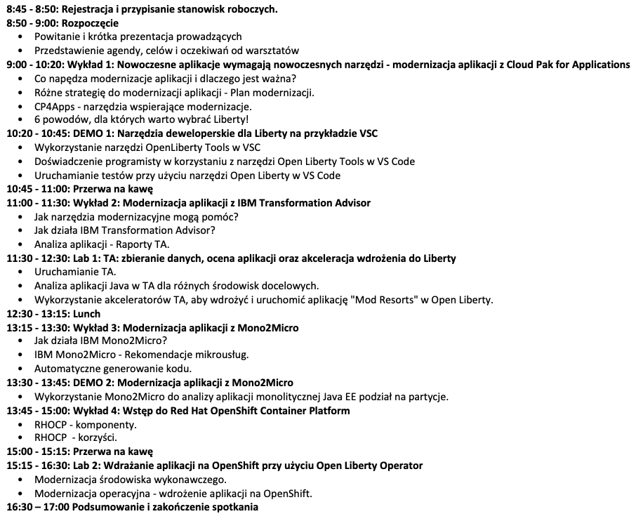

# Cloud Pak for Applications - Warsztaty praktyczne

**Lokalizacja:** IBM Polska - Krakowiaków 32, 02-255 Warszawa

**Data:** 

### Agenda warsztatów:

### Środowisko Laboratoryjne

W sprawie środowiska laboratoryjnego proszę o kontatk.

### Laboratoria:
1. [Lab1_TA](https://github.com/jawor96/Warsztaty_CP4Apps/tree/master/Lab1_TA)
2. [Lab2_Liberty_OCP](https://github.com/jawor96/Warsztaty_CP4Apps/tree/master/Lab2_Liberty_OCP)
### Prezentacje
[Prezentacje do pobrania.](https://github.com/jawor96/Warsztaty_CP4Apps/tree/master/Prezentacje)

### Kontakt

Mikołaj Jaworski

E-mail: mikolaj.jaworski2@ibm.com
